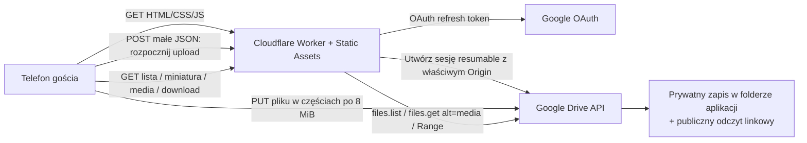

# PRD i kompletna specyfikacja wykonawcza — anonimowa galeria weselna na Google Drive

**Wersja:** 1.0  
**Data bazowa:** 21 lipca 2026  
**Status:** gotowe do przekazania agentowi AI  
**Nazwa repozytorium:** `wesele-galeria`  
**Priorytet:** prostota i niezawodność, bez rozbudowy zakresu

---

## 1. Streszczenie decyzji

Należy zbudować jedną prostą, mobilną stronę dostępną przez kod QR. Gość bez konta Google ma móc:

1. wybrać jedno lub wiele zdjęć albo filmów,
2. obserwować postęp przesyłania,
3. przeglądać wspólną galerię,
4. otworzyć zdjęcie lub odtworzyć film,
5. pobrać pojedynczy oryginalny plik.

System nie ma logowania gości, PIN-u, kont użytkowników, panelu administratora, bazy danych, komentarzy, polubień, filtrowania ani ustawień sortowania.

**Wybrana architektura:**

- Google Drive — jedyne trwałe miejsce przechowywania plików; wykorzystuje istniejące 5 TB właściciela.
- Google Drive API z zakresem OAuth `drive.file` — aplikacja ma dostęp wyłącznie do folderu i plików utworzonych przez nią.
- Cloudflare Worker — jeden mały backend oraz hosting trzech statycznych plików strony.
- Bez frameworka frontendowego i bez bazy danych.
- Przesyłanie wznawialne bezpośrednio z telefonu do Google w częściach po 8 MiB.
- Worker inicjuje sesję uploadu, listuje pliki i strumieniuje podgląd/pobieranie; duży plik uploadowany przez gościa nie przechodzi przez Worker.

Ta decyzja omija limit rozmiaru przychodzącego żądania Cloudflare i pozwala obsługiwać duże filmy. Odpowiedzi z plikami są strumieniowane, a filmy obsługują żądania HTTP `Range`.

---

## 2. Instrukcja nadrzędna dla agenta AI

Agent ma wykonać projekt od początku do końca zgodnie z tym dokumentem. Nie wolno rozszerzać zakresu bez technicznej konieczności.

### 2.1. Co agent ma wykonać samodzielnie

- utworzyć katalog projektu i wszystkie pliki podane w rozdziale 18,
- uruchomić `npm install`,
- sprawdzić składnię wszystkich plików JavaScript,
- wykonać próbny build Workera,
- poprowadzić właściciela przez minimalną konfigurację Google Cloud,
- uruchomić skrypt jednorazowej autoryzacji Google,
- uruchomić projekt lokalnie i wykonać test smoke,
- zainicjalizować Git, wykonać commit i wypchnąć prywatne repozytorium,
- zalogować Wrangler do Cloudflare, wdrożyć aplikację i wykonać produkcyjny test smoke,
- wygenerować plik PNG z kodem QR,
- wykonać testy ręczne na telefonach lub przygotować właścicielowi jednoznaczną checklistę urządzeń, których agent fizycznie nie ma,
- podać końcowy URL, ścieżkę kodu QR, ID folderu i wynik testów.

### 2.2. Jedyne dopuszczalne punkty udziału człowieka

1. Zalogowanie się do Google Cloud i utworzenie projektu/klienta OAuth, gdy agent nie ma dostępu do konta.
2. Zatwierdzenie jednorazowego ekranu zgody Google w przeglądarce.
3. Zatwierdzenie logowania GitHub i Cloudflare w przeglądarce, jeżeli CLI o to poprosi.

Agent nie powinien pytać o nazwy pary młodej, PIN, domenę, motyw graficzny ani dodatkowe funkcje. Ma pozostawić neutralny tytuł „Galeria weselna”, chyba że konkretne nazwy zostały podane wcześniej.

### 2.3. Zakaz rozbudowy

Nie dodawać:

- Reacta, Next.js, Vue ani innego frameworka,
- bazy danych, KV, D1, R2, Supabase lub Firebase,
- kont użytkowników, logowania gości, PIN-u lub CAPTCHA,
- panelu administratora,
- usuwania plików z poziomu strony,
- wyboru sortowania, filtrów, tagów, albumów i wyszukiwarki,
- komentarzy, reakcji, polubień i podpisów,
- analityki, reklam i trackerów,
- automatycznej kompresji lub transkodowania,
- pobierania całej galerii jako ZIP,
- niestandardowej domeny,
- CI/CD i GitHub Actions,
- osobnej aplikacji mobilnej.

Agent może wprowadzić wyłącznie małą poprawkę kompatybilności, jeśli podczas rzeczywistego wdrożenia zmieniło się API dostawcy. Każdą taką zmianę ma udokumentować.

---

## 3. Cel produktu

Zapewnić gościom weselnym najkrótszą możliwą ścieżkę:

> skanuję QR → wybieram zdjęcia/filmy → widzę postęp → materiały pojawiają się w galerii → mogę je obejrzeć lub pobrać.

### 3.1. Kryteria sukcesu

- Gość nie zakłada konta i nie loguje się do Google.
- Upload działa z Safari na iPhonie i Chrome na Androidzie.
- Zdjęcia i duże filmy nie są buforowane w pamięci Workera.
- Zerwanie połączenia nie powoduje bezwarunkowego rozpoczęcia całego filmu od zera.
- Obraz jest dostępny w pełnym rozmiarze.
- Film odtwarza się z możliwością przewijania albo ma niezawodny zapasowy podgląd Google.
- Każdy plik można pobrać osobno z zachowaniem nazwy.
- Po weselu system można wyłączyć bez migracji danych — pliki już są na Dysku Google.

---

## 4. Zakres

### 4.1. W zakresie

- anonimowe dodawanie wielu zdjęć i filmów,
- kolejka uploadu i postęp każdego pliku,
- automatyczne ponawianie błędów przejściowych,
- wznawianie po ponownym wybraniu tego samego pliku,
- galeria kafelkowa,
- zaznaczanie wielu materiałów w galerii,
- otwieranie zdjęcia,
- odtwarzanie filmu,
- zapasowy podgląd Google dla formatów, których przeglądarka nie obsługuje,
- pobieranie pojedynczego lub wielu zaznaczonych plików,
- automatyczne pobieranie wszystkich elementów galerii stronami po 100 rekordów,
- ręczne odświeżenie galerii,
- kod QR,
- lokalne i produkcyjne testy smoke.

### 4.2. Poza zakresem

Wszystkie funkcje wymienione w punkcie 2.3 oraz moderacja treści. Link jest świadomie publiczny dla jego posiadaczy.

---

## 5. Użytkownicy i przepływy

### 5.1. Gość dodaje pliki

1. Skanuje QR.
2. Otwiera stronę bez logowania.
3. Naciska „Wybierz pliki”.
4. Wybiera zdjęcia i/lub filmy.
5. Strona wysyła pliki pojedynczo.
6. Dla każdego pliku pokazuje nazwę, rozmiar, postęp i wynik.
7. Po sukcesie galeria odświeża się automatycznie.

### 5.2. Gość przegląda

1. Otwiera stronę.
2. Widzi wszystkie dostępne materiały, pobierane automatycznie stronami po 100 rekordów.
3. Naciska kafelek.
4. Zdjęcie otwiera się w oknie pełnoekranowym; film dostaje natywny odtwarzacz.
5. Przy problemie z kodekiem dostępny jest podgląd Google.

Nie ma interfejsu sortowania. Porządek techniczny jest stały: najnowsze pliki najpierw.

### 5.3. Gość pobiera

1. Zaznacza jeden lub więcej materiałów w galerii.
2. Naciska „Pobierz zaznaczone”.
3. Dla jednego zaznaczonego materiału przeglądarka pobiera bezpośrednio oryginalny plik.
4. Dla wielu zaznaczonych materiałów przeglądarka pobiera jedno archiwum `wspolne-wspomnienia.zip`.
5. Archiwum zawiera oryginalne pliki z zachowanymi nazwami; przy powtórzonych nazwach dodawany jest numer.

---

## 6. Architektura



### 6.1. Dlaczego upload omija Worker

Cloudflare Free ma limit 100 MB dla ciała przychodzącego żądania. Film może być dużo większy. Worker przekazuje więc przeglądarce jednorazowy adres sesji wznawialnej Google, a telefon wysyła dane bezpośrednio do Google.

### 6.2. Dlaczego pobieranie przechodzi przez Worker

Worker może przekazywać strumień odpowiedzi bez ładowania całego pliku do pamięci. Dzięki temu:

- nazwa pliku jest kontrolowana nagłówkiem `Content-Disposition`,
- film obsługuje `Range` i przewijanie,
- gość nie potrzebuje tokenu Google,
- nie trzeba tworzyć trwałych publicznych linków do surowych danych.

### 6.3. Dlaczego folder jest publiczny tylko do odczytu

Jest to potrzebne jako zapasowy anonimowy podgląd Google dla HEIC/HEVC/MOV lub filmu jeszcze nieobsługiwanego przez przeglądarkę. Goście nie otrzymują uprawnień edytora i nie mogą przez Dysk usuwać plików.

---

## 7. Model danych

Nie ma bazy danych. Źródłem prawdy jest folder Google Drive.

Dla każdego pliku wykorzystywane są pola:

- `id`,
- `name`,
- `mimeType`,
- `size`,
- `createdTime`,
- `thumbnailLink`,
- `webViewLink`,
- `webContentLink`,
- `resourceKey`.

Dodatkowo aplikacja zapisuje `appProperties.source = "wesele-galeria"`.

Google Drive dopuszcza duplikaty nazw; aplikacja ich nie scala i nie zmienia nazw. To jest celowe.

---

## 8. Uprawnienia i model dostępu

- Goście: brak konta, brak tokenu Google, brak logowania.
- Właściciel: jednorazowo autoryzuje aplikację.
- Zakres OAuth: wyłącznie `https://www.googleapis.com/auth/drive.file`.
- Folder i pliki: „każda osoba mająca link — wyświetlający”.
- Zapisywanie: tylko przez sesję utworzoną przez backend z tokenem właściciela.
- Sekrety: wyłącznie `.dev.vars` lokalnie i zaszyfrowane sekrety Workera w Cloudflare.
- `.dev.vars` nigdy nie trafia do Git.

### 8.1. Świadomie zaakceptowane ryzyko

Każdy, kto pozna URL aplikacji, może oglądać, pobierać i dodawać pliki. Może też próbować zapełniać miejsce lub generować ruch. Jest to świadoma decyzja właściciela wynikająca z braku PIN-u i innych zabezpieczeń. Po wydarzeniu aplikację należy wyłączyć.

Zakres `drive.file` ogranicza szkody: token aplikacji nie powinien zapewniać dostępu do całego Dysku, tylko do plików utworzonych lub udostępnionych tej aplikacji.

---

## 9. Wymagania funkcjonalne

| ID | Wymaganie |
|---|---|
| FR-01 | Strona działa bez logowania gościa. |
| FR-02 | Pole plików przyjmuje `image/*` i `video/*`, także wiele plików. |
| FR-03 | Pliki są przesyłane kolejno, nie równolegle. |
| FR-04 | Każdy plik ma osobny postęp i komunikat wyniku. |
| FR-05 | Duży plik jest wysyłany sesją wznawialną w częściach. |
| FR-06 | Sesja uploadu jest zapisywana w `localStorage` na maksymalnie 6 dni. |
| FR-07 | Ponowne wybranie tego samego pliku sprawdza stan sesji i wznawia upload. |
| FR-08 | Galeria pobiera metadane z Drive i pokazuje miniatury. |
| FR-09 | Galeria automatycznie pobiera wszystkie elementy, korzystając ze stronicowania API po 100 rekordów. |
| FR-10 | Zdjęcie otwiera się w podglądzie. |
| FR-11 | Film ma natywny odtwarzacz i obsługę przewijania. |
| FR-12 | HEIC/HEVC i nieobsługiwane media mają zapasowy podgląd Google. |
| FR-13 | Każdy materiał ma pobieranie pojedynczego oryginału; jedno zaznaczenie pobiera oryginał, a wiele zaznaczeń jedno archiwum ZIP. |
| FR-14 | Nie ma usuwania, edycji, opisu, komentarzy ani sortowania w UI. |
| FR-15 | Endpoint health sprawdza dostęp do właściwego folderu. |

---

## 10. Wymagania niezawodności

### 10.1. Upload

- Rozmiar części: 8 MiB, czyli wielokrotność wymaganych przez Google 256 KiB.
- Pliki są wysyłane jeden po drugim, aby nie zapychać pamięci i łącza telefonu.
- Błędy sieci, HTTP 408, 429 i 5xx są ponawiane z wykładniczym opóźnieniem i losowym jitterem.
- Po niejednoznacznym błędzie strona pyta Google, ile bajtów faktycznie odebrano.
- Odpowiedź 308 i nagłówek `Range` wyznaczają następny offset.
- Odpowiedź 404/410 oznacza wygaśnięcie sesji.
- Sesja Google może wygasnąć po około tygodniu; lokalny zapis jest celowo krótszy — 6 dni.
- Strona prosi o blokadę wygaszania ekranu, gdy przeglądarka to obsługuje.
- Strona ostrzega przed zamknięciem karty w trakcie uploadu.
- Po utracie Internetu czeka na zdarzenie `online`.

### 10.2. Krytyczny wymóg CORS

Sesja resumable musi zostać utworzona z nagłówkiem `Origin` równym dokładnemu originowi strony, z której telefon wykona później `PUT`. Worker wylicza go z `request.url`. Test smoke sprawdza preflight, `Access-Control-Allow-Origin`, `Access-Control-Expose-Headers` oraz dwuczęściowy upload z odpowiedzią 308.

### 10.3. Przeglądanie i pobieranie

- Worker przekazuje `Range`, `Content-Range`, `Accept-Ranges`, typ i długość pliku.
- Żądanie `HEAD` jest emulowane przez pobranie pierwszego bajtu i zwrócenie właściwej długości.
- Odpowiedzi są strumieniowane bez buforowania całego pliku.
- Miniatura jest najpierw pobierana bezpośrednio, a przy błędzie przez endpoint proxy.
- Dla materiału bez gotowej miniatury pokazywany jest prosty placeholder.
- Film świeżo wysłany może wymagać czasu na przetworzenie przez Google; pobieranie oryginału pozostaje dostępne.

---

## 11. Obsługiwane formaty

Frontend akceptuje wszystkie typy `image/*` i `video/*`. Dodatkowo rozpoznaje rozszerzenia używane przez telefony, gdy system nie przekaże MIME:

- obrazy: AVIF, GIF, HEIC, HEIF, JPEG/JPG, PNG, WebP,
- filmy: 3GP, M4V, MKV, MOV, MP4, MPEG/MPG, WebM.

Nie należy obiecywać natywnego odtwarzania każdego kodeka w każdej przeglądarce. Dla nieobsługiwanego kodeka pozostaje podgląd Google oraz pobieranie oryginału.

---

## 12. Ograniczenia operacyjne

1. Mobilny system operacyjny może wstrzymać kartę po zablokowaniu telefonu lub długim przejściu do innej aplikacji. Gość ma pozostawić stronę otwartą; po przerwaniu wybiera ten sam plik, aby wznowić.
2. Przetworzenie miniatury/streamu dużego filmu przez Google może potrwać od kilku sekund do dłużej. Nie jest to błąd uploadu.
3. Administrator Google Workspace może blokować publiczne udostępnianie lub aplikacje OAuth. Wtedy polityka organizacji musi zostać zmieniona albo należy użyć konta, które na to pozwala.
4. Aplikacja z `drive.file` jest przeznaczona do plików tworzonych przez nią. Nie należy ręcznie wrzucać obcych plików do folderu i oczekiwać, że zawsze pojawią się w API.
5. Google Workspace obecnie ogranicza łączny upload jednego użytkownika do 750 GB w ciągu 24 godzin, a pojedynczy plik do 5 TB.
6. Cloudflare Workers Free ma obecnie 100 000 żądań dziennie. Statyczne zasoby są małe; każde wyświetlanie/pobieranie przez API zużywa żądania. Dla typowego wesela limit jest duży, ale nie jest nielimitowany.
7. Limity i cenniki dostawców należy ponownie sprawdzić przed wydarzeniem, jeżeli wdrożenie następuje długo po dacie tego PRD.

---

## 13. API aplikacji

### `GET /api/health`

Sprawdza folder i OAuth.

Przykład odpowiedzi:

```json
{
  "ok": true,
  "folderId": "...",
  "folderName": "Galeria weselna"
}
```

### `GET /api/files?pageSize=100&pageToken=...`

Zwraca tylko zdjęcia i filmy znajdujące się w folderze.

```json
{
  "files": [
    {
      "id": "...",
      "name": "IMG_1234.HEIC",
      "mimeType": "image/heic",
      "size": 4312345,
      "createdTime": "2026-07-21T12:00:00Z",
      "kind": "image",
      "thumbnailLink": "...",
      "webViewLink": "...",
      "webContentLink": "...",
      "resourceKey": null
    }
  ],
  "nextPageToken": null
}
```

### `POST /api/uploads/init`

Żądanie:

```json
{
  "name": "VID_1234.MOV",
  "mimeType": "video/quicktime",
  "size": 734003200
}
```

Odpowiedź:

```json
{
  "uploadUrl": "https://www.googleapis.com/upload/drive/v3/files?...",
  "chunkSize": 8388608
}
```

### `GET /api/thumbnail/:fileId`

Proxy miniatury z krótkim cache przeglądarki.

### `GET|HEAD /api/media/:fileId?name=...&resourceKey=...`

Podgląd/stream oryginału. Przekazuje `Range`.

### `GET|HEAD /api/download/:fileId?name=...&resourceKey=...`

Pobieranie oryginału z `Content-Disposition: attachment`.

### `POST /api/download-archive`

Strumieniowe pobieranie jednego archiwum ZIP z co najmniej dwóch zaznaczonych oryginałów. Żądanie
może być JSON-em albo formularzem `application/x-www-form-urlencoded` z polem
`files`, zawierającym tablicę obiektów `{ id, name, size, resourceKey }`.
Endpoint przyjmuje maksymalnie 45 plików i łączny rozmiar deklarowany do 15 GB.
Używa ZIP64 i dodaje pliki bez kompresji, aby obsłużyć archiwa większe niż 4 GB,
nie obciążać dodatkowo Workera i zachować oryginalną zawartość.

---

## 14. Minimalne środowisko

- Node.js 20 lub nowszy,
- npm,
- Git,
- konto Google z miejscem na Dysku,
- konto Google Cloud,
- konto Cloudflare,
- konto GitHub i opcjonalnie GitHub CLI `gh`,
- nowoczesna przeglądarka.

Sprawdzenie:

```bash
node --version
npm --version
git --version
npx wrangler --version
```

---

## 15. Struktura projektu

```text
wesele-galeria/
├── .dev.vars.example
├── .gitignore
├── package.json
├── package-lock.json          # generowany przez npm install; commitować, nie edytować ręcznie
├── wrangler.jsonc
├── public/
│   ├── app.js
│   ├── index.html
│   └── styles.css
├── scripts/
│   ├── google-setup.mjs
│   └── smoke-test.mjs
└── src/
    └── worker.js
```

To jest minimalny praktyczny podział: trzy pliki strony, jeden Worker i dwa skrypty operacyjne. `package-lock.json` nie jest wklejony do PRD, ponieważ jest deterministycznie tworzony przez `npm install`; agent ma go wygenerować i commitować.

---

## 16. Kolejność wykonania przez agenta

### Etap A — inicjalizacja lokalna

```bash
mkdir wesele-galeria
cd wesele-galeria
```

Agent tworzy dokładnie pliki z rozdziału 18, a następnie:

```bash
npm install
node --check src/worker.js
node --check public/app.js
node --check scripts/google-setup.mjs
node --check scripts/smoke-test.mjs
npx wrangler deploy --dry-run
npm audit
```

Warunek przejścia: wszystkie kontrole składni i dry-run są poprawne. `npm audit` nie może zgłaszać znanej podatności w zależnościach produkcyjnych; projekt nie ma zależności runtime.

### Etap B — konfiguracja Google Cloud

Szczegóły są w rozdziale 17. Po utworzeniu klienta OAuth właściciel przekazuje agentowi Client ID i Client Secret lub sam wkleja je do interaktywnego skryptu:

```bash
npm run setup:google
```

Skrypt:

- uruchamia lokalny callback OAuth na losowym porcie `127.0.0.1`,
- używa PKCE S256 i `state`,
- prosi tylko o `drive.file`,
- pobiera refresh token,
- tworzy folder,
- ustawia folder jako publiczny tylko do odczytu,
- zapisuje `.dev.vars` z prawami pliku 0600 tam, gdzie system to wspiera.

### Etap C — test lokalny

Terminal 1:

```bash
npm run dev
```

Terminal 2:

```bash
npm run smoke -- http://127.0.0.1:8787
```

Następnie ręcznie otworzyć `http://127.0.0.1:8787`, dodać jedno prawdziwe zdjęcie i krótki film, sprawdzić podgląd i pobieranie.

### Etap D — Git i GitHub

```bash
git init
git branch -M main
git add .
git status
git commit -m "Initial wedding gallery"
gh auth login
gh repo create wesele-galeria --private --source=. --remote=origin --push
```

Repozytorium ma być prywatne. Przed commitem agent ma sprawdzić:

```bash
git status --short
git check-ignore -v .dev.vars
test -z "$(git ls-files .dev.vars)"
```

Oczekiwane: `.dev.vars` jest ignorowany i nie jest śledzony przez Git. Agent ma dodatkowo przejrzeć staged diff pod kątem przypadkowo wklejonych wartości sekretów.

Gdy `gh` nie jest dostępny, człowiek tworzy puste prywatne repozytorium bez README, a agent wykonuje:

```bash
git remote add origin <URL_REPOZYTORIUM>
git push -u origin main
```

### Etap E — Cloudflare

```bash
npx wrangler login
npm run deploy
```

Skrypt `deploy` przesyła zawartość `.dev.vars` jako sekrety Workera. Agent zapisuje URL zwrócony przez Wrangler, przykładowo:

```text
https://wesele-galeria.<subdomena>.workers.dev
```

Jeżeli konto Cloudflare nie ma jeszcze subdomeny `workers.dev`, interfejs może poprosić człowieka o jej jednorazowe utworzenie.

### Etap F — test produkcyjny

```bash
npm run smoke -- https://wesele-galeria.<subdomena>.workers.dev
```

Dodatkowo:

```bash
curl -fsS https://wesele-galeria.<subdomena>.workers.dev/api/health
```

Agent nie może uznać wdrożenia za gotowe, dopóki produkcyjny smoke nie przejdzie.

### Etap G — kod QR

```bash
npx --yes qrcode -o kod-qr.png -w 1200 "https://wesele-galeria.<subdomena>.workers.dev"
```

Kod QR ma być wydrukowany z wysokim kontrastem, bez nakładania logo na środek. Agent ma zeskanować końcowy wydruk z co najmniej jednego iPhone'a i jednego Androida albo przekazać tę czynność właścicielowi jako obowiązkowy test fizyczny.

---

## 17. Ręczna konfiguracja Google API

Interfejs Google może zmieniać nazwy sekcji, ale wymagane obiekty pozostają takie same.

### 17.1. Projekt i API

1. Otworzyć Google Cloud Console.
2. Utworzyć nowy projekt, np. `Wesele Galeria`.
3. W projekcie otworzyć „APIs & Services” / „Biblioteka”.
4. Wyszukać i włączyć **Google Drive API**.

### 17.2. Google Auth Platform / ekran zgody OAuth

1. Otworzyć konfigurację Google Auth Platform.
2. Branding:
   - nazwa aplikacji: `Galeria weselna`,
   - e-mail pomocy: konto właściciela,
   - e-mail kontaktowy: konto właściciela,
   - logo, strona główna i polityka prywatności nie są potrzebne do prywatnego jednorazowego projektu, o ile konsola ich nie wymusi.
3. Audience:
   - wybrać **Internal**, gdy konto Workspace i organizacja na to pozwalają,
   - w innym przypadku **External**.
4. Data Access / Scopes:
   - dodać wyłącznie `https://www.googleapis.com/auth/drive.file`.
5. Dla External w trybie Testing:
   - dodać konto właściciela jako test user.
6. Przed wydarzeniem przełączyć aplikację na **In production**, jeżeli została External. Refresh token aplikacji zewnętrznej pozostawionej w trybie Testing zwykle wygasa po 7 dniach. Zakres `drive.file` jest przez Google klasyfikowany jako non-sensitive, więc nie należy rozszerzać go do pełnego `drive`.

### 17.3. Klient OAuth

1. Otworzyć „Clients”.
2. Utworzyć nowy OAuth Client ID.
3. Typ aplikacji: **Desktop app / Aplikacja komputerowa**.
4. Nazwa: `Galeria weselna setup`.
5. Skopiować Client ID i Client Secret.
6. Nie dodawać ręcznie redirect URI. Skrypt używa `http://127.0.0.1:<losowy-port>` zgodnie z przepływem aplikacji desktopowej.

### 17.4. Autoryzacja i folder

W katalogu projektu:

```bash
npm run setup:google
```

Należy:

1. wkleić Client ID,
2. wkleić Client Secret,
3. zaakceptować nazwę folderu lub wpisać własną,
4. zalogować się na konto posiadające 5 TB,
5. zatwierdzić dostęp.

Po sukcesie powstaje `.dev.vars`:

```dotenv
GOOGLE_CLIENT_ID="..."
GOOGLE_CLIENT_SECRET="..."
GOOGLE_REFRESH_TOKEN="..."
GOOGLE_FOLDER_ID="..."
```

Nie wolno wysyłać tego pliku do GitHub ani komunikatorem.

### 17.5. Kontrola w Google Drive

Po wykonaniu skryptu:

- folder istnieje na właściwym koncie,
- dostęp ogólny folderu to „każda osoba mająca link — wyświetlający”,
- nie ma uprawnienia edytora dla anonimowych osób,
- folder nie jest usunięty ani przeniesiony do kosza.

---

## 18. Kompletne treści plików

Poniższy kod jest referencyjną implementacją. Agent może skopiować go bezpośrednio.

### `package.json`

````json
{
  "name": "wesele-galeria",
  "version": "1.0.0",
  "private": true,
  "type": "module",
  "engines": {
    "node": ">=20"
  },
  "scripts": {
    "dev": "wrangler dev",
    "deploy": "wrangler deploy --secrets-file .dev.vars",
    "setup:google": "node scripts/google-setup.mjs",
    "smoke": "node scripts/smoke-test.mjs"
  },
  "devDependencies": {
    "wrangler": "4.113.0"
  }
}
````
### `wrangler.jsonc`

````jsonc
{
  "$schema": "./node_modules/wrangler/config-schema.json",
  "name": "wesele-galeria",
  "main": "src/worker.js",
  "compatibility_date": "2026-07-21",
  "assets": {
    "directory": "./public"
  }
}
````
### `.gitignore`

````gitignore
node_modules/
.dev.vars
.dev.vars.*
.env
.env.*
.wrangler/
.DS_Store
*.log
kod-qr.png
````
### `.dev.vars.example`

````dotenv
GOOGLE_CLIENT_ID="000000000000-example.apps.googleusercontent.com"
GOOGLE_CLIENT_SECRET="example-secret"
GOOGLE_REFRESH_TOKEN="example-refresh-token"
GOOGLE_FOLDER_ID="example-folder-id"
````
### `src/worker.js`

````javascript
const DRIVE_API = "https://www.googleapis.com/drive/v3";
const DRIVE_UPLOAD_API = "https://www.googleapis.com/upload/drive/v3";
const TOKEN_URL = "https://oauth2.googleapis.com/token";
const DEFAULT_PAGE_SIZE = 100;
const MAX_PAGE_SIZE = 200;
const UPLOAD_CHUNK_SIZE = 8 * 1024 * 1024;

let tokenCache = {
  accessToken: null,
  expiresAt: 0,
};

export default {
  async fetch(request, env) {
    const url = new URL(request.url);

    if (!url.pathname.startsWith("/api/")) {
      return new Response("Not found", { status: 404 });
    }

    try {
      if (request.method === "GET" && url.pathname === "/api/health") {
        return handleHealth(env);
      }

      if (request.method === "GET" && url.pathname === "/api/files") {
        return handleListFiles(url, env);
      }

      if (request.method === "POST" && url.pathname === "/api/uploads/init") {
        return handleInitUpload(request, env);
      }

      const thumbnailMatch = url.pathname.match(/^\/api\/thumbnail\/([A-Za-z0-9_-]+)$/);
      if (request.method === "GET" && thumbnailMatch) {
        return handleThumbnail(thumbnailMatch[1], env);
      }

      const mediaMatch = url.pathname.match(/^\/api\/media\/([A-Za-z0-9_-]+)$/);
      if ((request.method === "GET" || request.method === "HEAD") && mediaMatch) {
        return handleMedia(request, url, mediaMatch[1], env, false);
      }

      const downloadMatch = url.pathname.match(/^\/api\/download\/([A-Za-z0-9_-]+)$/);
      if ((request.method === "GET" || request.method === "HEAD") && downloadMatch) {
        return handleMedia(request, url, downloadMatch[1], env, true);
      }

      return json({ error: "Nie znaleziono endpointu." }, 404);
    } catch (error) {
      console.error("Unhandled worker error", error);
      return json(
        {
          error: "Wewnętrzny błąd aplikacji.",
          detail: error instanceof Error ? error.message : String(error),
        },
        500,
      );
    }
  },
};

async function handleHealth(env) {
  assertEnv(env);

  const endpoint = new URL(`${DRIVE_API}/files/${encodeURIComponent(env.GOOGLE_FOLDER_ID)}`);
  endpoint.searchParams.set("fields", "id,name,mimeType,trashed");

  const response = await googleFetch(env, endpoint, { method: "GET" });
  if (!response.ok) {
    return googleError(response, "Nie udało się uzyskać dostępu do folderu Google Drive.");
  }

  const folder = await response.json();
  const validFolder =
    folder.mimeType === "application/vnd.google-apps.folder" && folder.trashed !== true;

  return json({
    ok: validFolder,
    folderId: folder.id,
    folderName: folder.name,
  }, validFolder ? 200 : 500);
}

async function handleListFiles(url, env) {
  assertEnv(env);

  const requestedPageSize = Number.parseInt(url.searchParams.get("pageSize") || "", 10);
  const pageSize = Number.isFinite(requestedPageSize)
    ? Math.min(Math.max(requestedPageSize, 1), MAX_PAGE_SIZE)
    : DEFAULT_PAGE_SIZE;
  const pageToken = url.searchParams.get("pageToken") || "";

  const endpoint = new URL(`${DRIVE_API}/files`);
  endpoint.searchParams.set(
    "q",
    `'${env.GOOGLE_FOLDER_ID}' in parents and trashed = false`,
  );
  endpoint.searchParams.set("spaces", "drive");
  endpoint.searchParams.set("pageSize", String(pageSize));
  endpoint.searchParams.set("orderBy", "createdTime desc");
  endpoint.searchParams.set(
    "fields",
    "nextPageToken,files(id,name,mimeType,size,createdTime,thumbnailLink,webViewLink,webContentLink,resourceKey)",
  );
  if (pageToken) {
    endpoint.searchParams.set("pageToken", pageToken);
  }

  const response = await googleFetch(env, endpoint, { method: "GET" });
  if (!response.ok) {
    return googleError(response, "Nie udało się pobrać galerii z Google Drive.");
  }

  const payload = await response.json();
  const files = (payload.files || [])
    .filter((file) => isAllowedMimeType(file.mimeType))
    .map((file) => ({
      id: file.id,
      name: file.name,
      mimeType: file.mimeType,
      size: Number(file.size || 0),
      createdTime: file.createdTime,
      kind: file.mimeType.startsWith("video/") ? "video" : "image",
      thumbnailLink: file.thumbnailLink || null,
      webViewLink: file.webViewLink || null,
      webContentLink: file.webContentLink || null,
      resourceKey: file.resourceKey || null,
    }));

  return json({
    files,
    nextPageToken: payload.nextPageToken || null,
  });
}

async function handleInitUpload(request, env) {
  assertEnv(env);

  let input;
  try {
    input = await request.json();
  } catch {
    return json({ error: "Nieprawidłowe dane żądania." }, 400);
  }

  const name = normalizeFileName(input?.name);
  const mimeType = typeof input?.mimeType === "string" ? input.mimeType.trim() : "";
  const size = Number(input?.size);

  if (!name) {
    return json({ error: "Brakuje poprawnej nazwy pliku." }, 400);
  }
  if (!isAllowedMimeType(mimeType)) {
    return json({ error: "Dozwolone są wyłącznie zdjęcia i filmy." }, 400);
  }
  if (!Number.isSafeInteger(size) || size <= 0) {
    return json({ error: "Nieprawidłowy rozmiar pliku." }, 400);
  }

  const endpoint = new URL(`${DRIVE_UPLOAD_API}/files`);
  endpoint.searchParams.set("uploadType", "resumable");
  endpoint.searchParams.set(
    "fields",
    "id,name,mimeType,size,createdTime,thumbnailLink,webViewLink,webContentLink,resourceKey",
  );

  const metadata = {
    name,
    mimeType,
    parents: [env.GOOGLE_FOLDER_ID],
    appProperties: {
      source: "wesele-galeria",
    },
  };

  // Google przypisuje CORS sesji resumable do Origin użytego przy jej
  // inicjalizacji. Musi to być dokładnie origin strony, która wykona PUT.
  const uploadOrigin = new URL(request.url).origin;

  const response = await googleFetch(env, endpoint, {
    method: "POST",
    headers: {
      "Content-Type": "application/json; charset=UTF-8",
      "X-Upload-Content-Type": mimeType,
      "X-Upload-Content-Length": String(size),
      Origin: uploadOrigin,
    },
    body: JSON.stringify(metadata),
  });

  if (!response.ok) {
    return googleError(response, "Nie udało się rozpocząć przesyłania pliku.");
  }

  const uploadUrl = response.headers.get("Location");
  if (!uploadUrl) {
    return json({ error: "Google nie zwrócił adresu sesji przesyłania." }, 502);
  }

  return json({
    uploadUrl,
    chunkSize: UPLOAD_CHUNK_SIZE,
  });
}

async function handleThumbnail(fileId, env) {
  assertEnv(env);

  const metadataUrl = new URL(`${DRIVE_API}/files/${encodeURIComponent(fileId)}`);
  metadataUrl.searchParams.set("fields", "thumbnailLink");

  const metadataResponse = await googleFetch(env, metadataUrl, { method: "GET" });
  if (!metadataResponse.ok) {
    return new Response("Miniatura jest niedostępna.", { status: 404 });
  }

  const metadata = await metadataResponse.json();
  if (!metadata.thumbnailLink) {
    return new Response("Miniatura nie została jeszcze utworzona.", { status: 404 });
  }

  const token = await getAccessToken(env);
  const thumbnailResponse = await fetch(metadata.thumbnailLink, {
    headers: {
      Authorization: `Bearer ${token}`,
    },
  });

  if (!thumbnailResponse.ok) {
    return new Response("Miniatura jest niedostępna.", { status: 404 });
  }

  const headers = copyHeaders(thumbnailResponse.headers, [
    "content-type",
    "content-length",
    "etag",
    "last-modified",
  ]);
  headers.set("Cache-Control", "public, max-age=3600");

  return new Response(thumbnailResponse.body, {
    status: thumbnailResponse.status,
    headers,
  });
}

async function handleMedia(request, url, fileId, env, forceDownload) {
  assertEnv(env);

  const endpoint = new URL(`${DRIVE_API}/files/${encodeURIComponent(fileId)}`);
  endpoint.searchParams.set("alt", "media");
  if (url.searchParams.get("resourceKey")) {
    endpoint.searchParams.set("resourceKey", url.searchParams.get("resourceKey"));
  }

  const upstreamHeaders = new Headers();
  const range = request.headers.get("Range");
  if (range) {
    upstreamHeaders.set("Range", range);
  }

  let upstreamMethod = request.method;
  if (request.method === "HEAD") {
    upstreamMethod = "GET";
    upstreamHeaders.set("Range", "bytes=0-0");
  }

  const response = await googleFetch(env, endpoint, {
    method: upstreamMethod,
    headers: upstreamHeaders,
  });

  if (!response.ok && response.status !== 206) {
    const status = response.status === 404 ? 404 : 502;
    return new Response("Plik jest chwilowo niedostępny.", { status });
  }

  const headers = copyHeaders(response.headers, [
    "content-type",
    "content-length",
    "content-range",
    "accept-ranges",
    "etag",
    "last-modified",
  ]);

  const requestedName = normalizeFileName(url.searchParams.get("name")) || "plik";
  headers.set(
    "Content-Disposition",
    createContentDisposition(forceDownload ? "attachment" : "inline", requestedName),
  );
  headers.set("Cache-Control", forceDownload ? "private, no-store" : "public, max-age=3600");
  headers.set("X-Content-Type-Options", "nosniff");

  if (request.method === "HEAD") {
    const contentRange = response.headers.get("Content-Range");
    const total = contentRange?.match(/\/(\d+)$/)?.[1];
    if (total) {
      headers.set("Content-Length", total);
    } else {
      headers.delete("Content-Length");
    }
    response.body?.cancel();
    return new Response(null, { status: 200, headers });
  }

  return new Response(response.body, {
    status: response.status,
    headers,
  });
}

async function googleFetch(env, input, init = {}, attempt = 0) {
  const token = await getAccessToken(env);
  const headers = new Headers(init.headers || {});
  headers.set("Authorization", `Bearer ${token}`);

  const response = await fetch(input, {
    ...init,
    headers,
  });

  if (response.status === 401 && attempt === 0) {
    tokenCache = { accessToken: null, expiresAt: 0 };
    return googleFetch(env, input, init, attempt + 1);
  }

  if (isRetryableStatus(response.status) && attempt < 3) {
    response.body?.cancel();
    const retryAfter = parseRetryAfter(response.headers.get("Retry-After"));
    const delay = retryAfter ?? Math.min(500 * (2 ** attempt) + Math.floor(Math.random() * 300), 5000);
    await sleep(delay);
    return googleFetch(env, input, init, attempt + 1);
  }

  return response;
}

async function getAccessToken(env) {
  assertEnv(env);

  if (tokenCache.accessToken && Date.now() < tokenCache.expiresAt) {
    return tokenCache.accessToken;
  }

  const body = new URLSearchParams({
    client_id: env.GOOGLE_CLIENT_ID,
    client_secret: env.GOOGLE_CLIENT_SECRET,
    refresh_token: env.GOOGLE_REFRESH_TOKEN,
    grant_type: "refresh_token",
  });

  const response = await fetch(TOKEN_URL, {
    method: "POST",
    headers: {
      "Content-Type": "application/x-www-form-urlencoded",
    },
    body,
  });

  if (!response.ok) {
    const detail = await response.text();
    throw new Error(`Nie udało się odświeżyć tokenu Google OAuth: ${detail}`);
  }

  const payload = await response.json();
  tokenCache = {
    accessToken: payload.access_token,
    expiresAt: Date.now() + Math.max(Number(payload.expires_in || 3600) - 120, 60) * 1000,
  };

  return tokenCache.accessToken;
}

async function googleError(response, fallbackMessage) {
  let detail = "";
  try {
    detail = await response.text();
  } catch {
    detail = "";
  }

  console.error("Google API error", response.status, detail);
  return json(
    {
      error: fallbackMessage,
      googleStatus: response.status,
      detail: detail.slice(0, 1000),
    },
    response.status >= 400 && response.status < 500 ? response.status : 502,
  );
}

function isRetryableStatus(status) {
  return status === 408 || status === 429 || status === 500 || status === 502 || status === 503 || status === 504;
}

function parseRetryAfter(value) {
  if (!value) {
    return null;
  }
  const seconds = Number(value);
  if (Number.isFinite(seconds) && seconds >= 0) {
    return Math.min(seconds * 1000, 10_000);
  }
  const date = Date.parse(value);
  if (Number.isFinite(date)) {
    return Math.max(0, Math.min(date - Date.now(), 10_000));
  }
  return null;
}

function sleep(milliseconds) {
  return new Promise((resolve) => setTimeout(resolve, milliseconds));
}

function assertEnv(env) {
  const required = [
    "GOOGLE_CLIENT_ID",
    "GOOGLE_CLIENT_SECRET",
    "GOOGLE_REFRESH_TOKEN",
    "GOOGLE_FOLDER_ID",
  ];
  const missing = required.filter((key) => !env[key]);
  if (missing.length > 0) {
    throw new Error(`Brak wymaganych zmiennych środowiskowych: ${missing.join(", ")}`);
  }
}

function isAllowedMimeType(mimeType) {
  return typeof mimeType === "string" &&
    (mimeType.startsWith("image/") || mimeType.startsWith("video/"));
}

function normalizeFileName(value) {
  if (typeof value !== "string") {
    return "";
  }

  return value
    .replace(/[\u0000-\u001F\u007F]/g, "")
    .replace(/[\\/]/g, "_")
    .trim()
    .slice(0, 240);
}

function createContentDisposition(disposition, fileName) {
  const asciiName = fileName
    .normalize("NFKD")
    .replace(/[^\x20-\x7E]/g, "_")
    .replace(/["\\]/g, "_");
  const encoded = encodeURIComponent(fileName).replace(/[!'()*]/g, (char) =>
    `%${char.charCodeAt(0).toString(16).toUpperCase()}`,
  );
  return `${disposition}; filename="${asciiName}"; filename*=UTF-8''${encoded}`;
}

function copyHeaders(source, names) {
  const output = new Headers();
  for (const name of names) {
    const value = source.get(name);
    if (value) {
      output.set(name, value);
    }
  }
  return output;
}

function json(value, status = 200) {
  return new Response(JSON.stringify(value), {
    status,
    headers: {
      "Content-Type": "application/json; charset=utf-8",
      "Cache-Control": "no-store",
    },
  });
}
````
### `public/index.html`

````html
<!doctype html>
<html lang="pl">
  <head>
    <meta charset="utf-8">
    <meta name="viewport" content="width=device-width, initial-scale=1, viewport-fit=cover">
    <meta name="robots" content="noindex, nofollow, noarchive">
    <meta name="theme-color" content="#f7f2ed">
    <title>Galeria weselna</title>
    <link rel="stylesheet" href="/styles.css">
  </head>
  <body>
    <header class="hero">
      <p class="eyebrow">Wspólne wspomnienia</p>
      <h1>Galeria weselna</h1>
      <p>Dodaj zdjęcia i filmy z telefonu. Konto Google nie jest potrzebne.</p>
    </header>

    <main>
      <section class="panel upload-panel" aria-labelledby="upload-title">
        <div>
          <h2 id="upload-title">Dodaj zdjęcia i filmy</h2>
          <p class="muted">Podczas wysyłania pozostaw tę stronę otwartą. Pliki są przesyłane pojedynczo, aby działało to stabilnie także przez Internet mobilny.</p>
        </div>

        <label class="primary-button" for="file-input">Wybierz pliki</label>
        <input id="file-input" type="file" accept="image/*,video/*" multiple hidden>

        <p id="upload-summary" class="status" role="status" aria-live="polite"></p>
        <div id="upload-queue" class="upload-queue" aria-live="polite"></div>
      </section>

      <section class="gallery-section" aria-labelledby="gallery-title">
        <div class="section-heading">
          <div>
            <p class="eyebrow">Zdjęcia i filmy gości</p>
            <h2 id="gallery-title">Galeria</h2>
          </div>
          <button id="refresh-button" class="text-button" type="button">Odśwież</button>
        </div>

        <p id="gallery-status" class="status" role="status" aria-live="polite">Ładowanie galerii…</p>
        <div id="gallery" class="gallery" aria-live="polite"></div>
        <button id="load-more-button" class="secondary-button" type="button" hidden>Pokaż więcej</button>
      </section>
    </main>

    <dialog id="viewer" class="viewer">
      <div class="viewer-shell">
        <header class="viewer-header">
          <p id="viewer-title" class="viewer-title"></p>
          <button id="viewer-close" class="icon-button" type="button" aria-label="Zamknij podgląd">×</button>
        </header>
        <div id="viewer-content" class="viewer-content"></div>
        <footer class="viewer-actions">
          <a id="viewer-download" class="primary-button compact" href="#" download>Pobierz plik</a>
          <a id="viewer-drive" class="secondary-button compact" href="#" target="_blank" rel="noopener">Otwórz podgląd Google</a>
        </footer>
      </div>
    </dialog>

    <noscript>Ta strona wymaga włączonej obsługi JavaScript.</noscript>
    <script type="module" src="/app.js"></script>
  </body>
</html>
````
### `public/styles.css`

````css
:root {
  color-scheme: light;
  --background: #f7f2ed;
  --surface: #ffffff;
  --surface-soft: #fcfaf8;
  --text: #302923;
  --muted: #71675f;
  --line: #e6ddd5;
  --accent: #6f4937;
  --accent-strong: #583627;
  --danger: #a43a35;
  --success: #24734d;
  --shadow: 0 18px 50px rgba(62, 45, 35, 0.09);
  font-family: Inter, ui-sans-serif, system-ui, -apple-system, BlinkMacSystemFont, "Segoe UI", sans-serif;
}

* {
  box-sizing: border-box;
}

html {
  min-height: 100%;
  background: var(--background);
}

body {
  min-height: 100%;
  margin: 0;
  color: var(--text);
  background:
    radial-gradient(circle at top left, rgba(255, 255, 255, 0.95), transparent 34rem),
    var(--background);
}

button,
input,
a {
  font: inherit;
}

button,
a,
label {
  -webkit-tap-highlight-color: transparent;
}

.hero {
  width: min(72rem, calc(100% - 2rem));
  margin: 0 auto;
  padding: clamp(3.5rem, 9vw, 7rem) 0 clamp(2rem, 5vw, 3.5rem);
  text-align: center;
}

.hero h1,
.section-heading h2,
.panel h2 {
  margin: 0;
  font-family: Georgia, "Times New Roman", serif;
  font-weight: 500;
  line-height: 1.04;
}

.hero h1 {
  font-size: clamp(2.6rem, 10vw, 5.8rem);
}

.hero > p:last-child {
  max-width: 42rem;
  margin: 1rem auto 0;
  color: var(--muted);
  font-size: clamp(1rem, 2.8vw, 1.2rem);
  line-height: 1.6;
}

.eyebrow {
  margin: 0 0 0.65rem;
  color: var(--accent);
  font-size: 0.76rem;
  font-weight: 800;
  letter-spacing: 0.15em;
  text-transform: uppercase;
}

main {
  width: min(72rem, calc(100% - 2rem));
  margin: 0 auto;
  padding-bottom: 5rem;
}

.panel {
  display: grid;
  gap: 1.25rem;
  padding: clamp(1.4rem, 4vw, 2.25rem);
  border: 1px solid var(--line);
  border-radius: 1.5rem;
  background: rgba(255, 255, 255, 0.9);
  box-shadow: var(--shadow);
}

.panel h2,
.section-heading h2 {
  font-size: clamp(2rem, 6vw, 3.1rem);
}

.muted,
.status {
  color: var(--muted);
  line-height: 1.55;
}

.muted {
  max-width: 50rem;
  margin: 0.75rem 0 0;
}

.status {
  min-height: 1.4rem;
  margin: 0;
}

.primary-button,
.secondary-button,
.text-button,
.icon-button {
  border: 0;
  cursor: pointer;
  text-decoration: none;
}

.primary-button,
.secondary-button {
  display: inline-flex;
  min-height: 3.25rem;
  align-items: center;
  justify-content: center;
  padding: 0.8rem 1.25rem;
  border-radius: 999px;
  font-weight: 750;
  transition: transform 120ms ease, background 120ms ease, border-color 120ms ease;
}

.primary-button {
  width: fit-content;
  color: #fff;
  background: var(--accent);
}

.primary-button:hover {
  background: var(--accent-strong);
}

.secondary-button {
  color: var(--text);
  border: 1px solid var(--line);
  background: var(--surface);
}

.primary-button:active,
.secondary-button:active,
.text-button:active,
.icon-button:active {
  transform: translateY(1px);
}

.primary-button:focus-visible,
.secondary-button:focus-visible,
.text-button:focus-visible,
.icon-button:focus-visible,
.gallery-card:focus-visible {
  outline: 3px solid rgba(111, 73, 55, 0.3);
  outline-offset: 3px;
}

.primary-button.compact,
.secondary-button.compact {
  min-height: 2.75rem;
  padding: 0.65rem 1rem;
}

.upload-queue {
  display: grid;
  gap: 0.85rem;
}

.upload-item {
  display: grid;
  grid-template-columns: minmax(0, 1fr) auto;
  gap: 0.55rem 1rem;
  padding: 1rem;
  border: 1px solid var(--line);
  border-radius: 1rem;
  background: var(--surface-soft);
}

.upload-name {
  overflow: hidden;
  font-weight: 700;
  text-overflow: ellipsis;
  white-space: nowrap;
}

.upload-detail {
  color: var(--muted);
  font-size: 0.86rem;
  white-space: nowrap;
}

.upload-message {
  grid-column: 1 / -1;
  margin: 0;
  color: var(--muted);
  font-size: 0.88rem;
}

.upload-message.error {
  color: var(--danger);
}

.upload-message.success {
  color: var(--success);
}

progress {
  grid-column: 1 / -1;
  width: 100%;
  height: 0.55rem;
  overflow: hidden;
  border: 0;
  border-radius: 999px;
  accent-color: var(--accent);
  background: var(--line);
}

progress::-webkit-progress-bar {
  border-radius: 999px;
  background: var(--line);
}

progress::-webkit-progress-value {
  border-radius: 999px;
  background: var(--accent);
}

progress::-moz-progress-bar {
  border-radius: 999px;
  background: var(--accent);
}

.gallery-section {
  margin-top: clamp(3rem, 8vw, 5.5rem);
}

.section-heading {
  display: flex;
  align-items: end;
  justify-content: space-between;
  gap: 1rem;
  margin-bottom: 1.25rem;
}

.text-button {
  padding: 0.7rem 0;
  color: var(--accent);
  background: transparent;
  font-weight: 750;
}

.gallery {
  display: grid;
  grid-template-columns: repeat(2, minmax(0, 1fr));
  gap: 0.65rem;
}

.gallery-card {
  position: relative;
  min-width: 0;
  overflow: hidden;
  padding: 0;
  border: 0;
  border-radius: 0.9rem;
  aspect-ratio: 1 / 1;
  cursor: pointer;
  background: #e9e2dc;
  box-shadow: 0 8px 26px rgba(64, 48, 38, 0.08);
}

.gallery-card img {
  width: 100%;
  height: 100%;
  display: block;
  object-fit: cover;
  transition: transform 180ms ease;
}

.gallery-card:hover img {
  transform: scale(1.025);
}

.gallery-placeholder {
  display: grid;
  width: 100%;
  height: 100%;
  place-items: center;
  color: var(--muted);
  font-size: 2rem;
}

.video-badge {
  position: absolute;
  right: 0.55rem;
  bottom: 0.55rem;
  display: inline-flex;
  min-width: 2.2rem;
  min-height: 2.2rem;
  align-items: center;
  justify-content: center;
  border-radius: 999px;
  color: #fff;
  background: rgba(26, 22, 19, 0.72);
  backdrop-filter: blur(8px);
}

.empty-state {
  grid-column: 1 / -1;
  padding: 3rem 1rem;
  border: 1px dashed var(--line);
  border-radius: 1.25rem;
  color: var(--muted);
  text-align: center;
}

#load-more-button {
  margin: 1.25rem auto 0;
}

.viewer {
  width: min(70rem, calc(100% - 1rem));
  max-width: none;
  height: min(92dvh, 58rem);
  max-height: none;
  padding: 0;
  border: 0;
  border-radius: 1.3rem;
  color: var(--text);
  background: var(--surface);
  box-shadow: 0 30px 100px rgba(32, 24, 20, 0.35);
}

.viewer::backdrop {
  background: rgba(29, 24, 21, 0.76);
  backdrop-filter: blur(5px);
}

.viewer-shell {
  display: grid;
  grid-template-rows: auto minmax(0, 1fr) auto;
  height: 100%;
}

.viewer-header,
.viewer-actions {
  display: flex;
  align-items: center;
  gap: 0.75rem;
  padding: 0.85rem 1rem;
  border-color: var(--line);
}

.viewer-header {
  justify-content: space-between;
  border-bottom: 1px solid var(--line);
}

.viewer-actions {
  flex-wrap: wrap;
  justify-content: center;
  border-top: 1px solid var(--line);
}

.viewer-title {
  min-width: 0;
  margin: 0;
  overflow: hidden;
  font-weight: 700;
  text-overflow: ellipsis;
  white-space: nowrap;
}

.icon-button {
  display: inline-grid;
  width: 2.6rem;
  height: 2.6rem;
  flex: 0 0 auto;
  place-items: center;
  border-radius: 999px;
  color: var(--text);
  background: var(--surface-soft);
  font-size: 1.65rem;
  line-height: 1;
}

.viewer-content {
  position: relative;
  display: grid;
  min-height: 0;
  overflow: hidden;
  place-items: center;
  background: #171412;
}

.viewer-content img,
.viewer-content video,
.viewer-content iframe {
  width: 100%;
  height: 100%;
  border: 0;
}

.viewer-content img,
.viewer-content video {
  object-fit: contain;
}

.viewer-note {
  max-width: 34rem;
  margin: 1rem;
  padding: 1.25rem;
  border-radius: 1rem;
  color: #fff;
  background: rgba(255, 255, 255, 0.1);
  text-align: center;
  line-height: 1.55;
}

body.dialog-open {
  overflow: hidden;
}

@media (min-width: 40rem) {
  .upload-panel {
    grid-template-columns: minmax(0, 1fr) auto;
    align-items: center;
  }

  .upload-panel .status,
  .upload-panel .upload-queue {
    grid-column: 1 / -1;
  }

  .gallery {
    grid-template-columns: repeat(3, minmax(0, 1fr));
    gap: 0.9rem;
  }
}

@media (min-width: 64rem) {
  .gallery {
    grid-template-columns: repeat(4, minmax(0, 1fr));
    gap: 1rem;
  }
}

@media (prefers-reduced-motion: reduce) {
  *,
  *::before,
  *::after {
    scroll-behavior: auto !important;
    transition: none !important;
  }
}
````
### `public/app.js`

````javascript
const API = "/api";
const DEFAULT_CHUNK_SIZE = 8 * 1024 * 1024;
const MAX_RETRIES = 6;
const SESSION_MAX_AGE_MS = 6 * 24 * 60 * 60 * 1000;

const MIME_BY_EXTENSION = {
  avif: "image/avif",
  gif: "image/gif",
  heic: "image/heic",
  heif: "image/heif",
  jpeg: "image/jpeg",
  jpg: "image/jpeg",
  png: "image/png",
  webp: "image/webp",
  "3gp": "video/3gpp",
  m4v: "video/x-m4v",
  mkv: "video/x-matroska",
  mov: "video/quicktime",
  mp4: "video/mp4",
  mpeg: "video/mpeg",
  mpg: "video/mpeg",
  webm: "video/webm",
};

const elements = {
  fileInput: document.querySelector("#file-input"),
  uploadSummary: document.querySelector("#upload-summary"),
  uploadQueue: document.querySelector("#upload-queue"),
  gallery: document.querySelector("#gallery"),
  galleryStatus: document.querySelector("#gallery-status"),
  refreshButton: document.querySelector("#refresh-button"),
  loadMoreButton: document.querySelector("#load-more-button"),
  viewer: document.querySelector("#viewer"),
  viewerTitle: document.querySelector("#viewer-title"),
  viewerContent: document.querySelector("#viewer-content"),
  viewerDownload: document.querySelector("#viewer-download"),
  viewerDrive: document.querySelector("#viewer-drive"),
  viewerClose: document.querySelector("#viewer-close"),
};

const state = {
  uploading: false,
  nextPageToken: null,
  galleryLoading: false,
  wakeLock: null,
};

elements.fileInput.addEventListener("change", handleFileSelection);
elements.refreshButton.addEventListener("click", () => loadGallery({ reset: true }));
elements.loadMoreButton.addEventListener("click", () => loadGallery({ reset: false }));
elements.viewerClose.addEventListener("click", closeViewer);
elements.viewer.addEventListener("cancel", (event) => {
  event.preventDefault();
  closeViewer();
});
elements.viewer.addEventListener("click", (event) => {
  if (event.target === elements.viewer) {
    closeViewer();
  }
});
window.addEventListener("beforeunload", (event) => {
  if (!state.uploading) {
    return;
  }
  event.preventDefault();
  event.returnValue = "";
});
window.addEventListener("online", () => {
  if (!state.uploading) {
    elements.uploadSummary.textContent = "Połączenie z Internetem zostało przywrócone.";
  }
});
window.addEventListener("offline", () => {
  elements.uploadSummary.textContent = "Brak Internetu. Przesyłanie zostanie ponowione po odzyskaniu połączenia.";
});
document.addEventListener("visibilitychange", async () => {
  if (document.visibilityState === "visible" && state.uploading) {
    await requestWakeLock();
  }
});

loadGallery({ reset: true });

async function handleFileSelection() {
  const files = Array.from(elements.fileInput.files || []);
  elements.fileInput.value = "";

  if (files.length === 0 || state.uploading) {
    return;
  }

  const prepared = files.map(prepareFile);
  const rejected = prepared.filter((entry) => !entry.ok);
  const accepted = prepared.filter((entry) => entry.ok);

  elements.uploadQueue.replaceChildren();
  for (const entry of prepared) {
    entry.row = createUploadRow(entry.file, entry.ok ? "Oczekuje" : entry.error);
    elements.uploadQueue.append(entry.row.root);
    if (!entry.ok) {
      setRowState(entry.row, 0, entry.error, "error");
    }
  }

  if (accepted.length === 0) {
    elements.uploadSummary.textContent = "Nie wybrano obsługiwanych zdjęć ani filmów.";
    return;
  }

  state.uploading = true;
  await requestWakeLock();
  let successCount = 0;

  try {
    for (let index = 0; index < accepted.length; index += 1) {
      const entry = accepted[index];
      elements.uploadSummary.textContent = `Przesyłanie ${index + 1} z ${accepted.length}…`;
      try {
        await uploadFile(entry.file, entry.mimeType, entry.row);
        successCount += 1;
      } catch (error) {
        console.error("Upload failed", error);
        setRowState(entry.row, entry.row.progress.value, readableError(error), "error");
      }
    }
  } finally {
    state.uploading = false;
    await releaseWakeLock();
  }

  const failureCount = accepted.length - successCount + rejected.length;
  if (successCount > 0 && failureCount === 0) {
    elements.uploadSummary.textContent = `Gotowe. Przesłano ${successCount} ${fileWord(successCount)}.`;
  } else if (successCount > 0) {
    elements.uploadSummary.textContent = `Przesłano ${successCount} ${fileWord(successCount)}. Nie udało się przesłać ${failureCount}.`;
  } else {
    elements.uploadSummary.textContent = "Nie udało się przesłać plików. Sprawdź Internet i spróbuj ponownie.";
  }

  if (successCount > 0) {
    await sleep(1200);
    await loadGallery({ reset: true });
    window.setTimeout(() => loadGallery({ reset: true, quiet: true }), 7000);
  }
}

function prepareFile(file) {
  const mimeType = detectMimeType(file);
  if (!mimeType || (!mimeType.startsWith("image/") && !mimeType.startsWith("video/"))) {
    return {
      ok: false,
      file,
      mimeType: "",
      error: "Ten plik nie jest rozpoznanym zdjęciem ani filmem.",
    };
  }

  if (!Number.isSafeInteger(file.size) || file.size <= 0) {
    return {
      ok: false,
      file,
      mimeType,
      error: "Plik jest pusty albo ma nieprawidłowy rozmiar.",
    };
  }

  return { ok: true, file, mimeType };
}

function detectMimeType(file) {
  if (file.type && (file.type.startsWith("image/") || file.type.startsWith("video/"))) {
    return file.type;
  }
  const extension = file.name.split(".").pop()?.toLowerCase() || "";
  return MIME_BY_EXTENSION[extension] || "";
}

async function uploadFile(file, mimeType, row) {
  const key = sessionStorageKey(file);
  const saved = readSavedSession(key, file);
  let uploadUrl = saved?.uploadUrl || "";
  let offset = 0;
  let chunkSize = saved?.chunkSize || DEFAULT_CHUNK_SIZE;

  if (uploadUrl) {
    setRowState(row, 0, "Sprawdzanie poprzedniej sesji…");
    const status = await withRetries(
      () => queryUploadStatus(uploadUrl, file.size),
      row,
      "Sprawdzanie sesji",
    );

    if (status.complete) {
      localStorage.removeItem(key);
      setRowState(row, 100, "Przesłano", "success");
      return;
    }
    if (status.expired) {
      localStorage.removeItem(key);
      uploadUrl = "";
    } else {
      offset = status.offset;
      setRowState(row, percentage(offset, file.size), "Wznawianie przesyłania…");
    }
  }

  if (!uploadUrl) {
    setRowState(row, 0, "Rozpoczynanie przesyłania…");
    const session = await withRetries(
      () => createUploadSession(file, mimeType),
      row,
      "Rozpoczęcie przesyłania",
    );
    uploadUrl = session.uploadUrl;
    chunkSize = normalizeChunkSize(session.chunkSize);
    saveSession(key, file, uploadUrl, chunkSize);
  }

  while (offset < file.size) {
    const endExclusive = Math.min(offset + chunkSize, file.size);
    const chunk = file.slice(offset, endExclusive);
    const chunkStart = offset;

    const result = await uploadChunkWithRecovery({
      uploadUrl,
      chunk,
      start: chunkStart,
      endInclusive: endExclusive - 1,
      total: file.size,
      mimeType,
      row,
      onProgress: (loaded) => {
        const sent = Math.min(chunkStart + loaded, file.size);
        setRowState(row, percentage(sent, file.size), `Przesyłanie: ${formatBytes(sent)} z ${formatBytes(file.size)}`);
      },
    });

    if (result.complete) {
      localStorage.removeItem(key);
      setRowState(row, 100, "Przesłano", "success");
      return;
    }

    if (result.expired) {
      localStorage.removeItem(key);
      throw new Error("Sesja przesyłania wygasła. Wybierz plik ponownie.");
    }

    offset = result.offset;
    saveSession(key, file, uploadUrl, chunkSize, offset);
    setRowState(row, percentage(offset, file.size), `Przesłano ${formatBytes(offset)} z ${formatBytes(file.size)}`);
  }

  const finalStatus = await queryUploadStatus(uploadUrl, file.size);
  if (!finalStatus.complete) {
    throw new Error("Google nie potwierdził zakończenia przesyłania.");
  }
  localStorage.removeItem(key);
  setRowState(row, 100, "Przesłano", "success");
}

async function createUploadSession(file, mimeType) {
  let response;
  try {
    response = await fetch(`${API}/uploads/init`, {
      method: "POST",
      headers: { "Content-Type": "application/json" },
      body: JSON.stringify({
        name: file.name,
        mimeType,
        size: file.size,
      }),
    });
  } catch {
    throw new RetryableError("Nie udało się połączyć z serwerem galerii.");
  }

  const payload = await parseJson(response);
  if (!response.ok || !payload.uploadUrl) {
    const message = payload.error || "Nie udało się rozpocząć przesyłania.";
    if (response.status === 408 || response.status === 429 || response.status >= 500) {
      throw new RetryableError(message, response.status);
    }
    throw new Error(message);
  }
  return payload;
}

async function uploadChunkWithRecovery(options) {
  let lastError;

  for (let attempt = 0; attempt <= MAX_RETRIES; attempt += 1) {
    try {
      return await uploadChunk(options);
    } catch (error) {
      lastError = error;
      if (!isRetryable(error) || attempt === MAX_RETRIES) {
        throw error;
      }

      const delay = retryDelay(attempt);
      setRowState(options.row, options.row.progress.value, `Sprawdzanie przesłanych danych i ponowienie za ${Math.ceil(delay / 1000)} s…`);
      await waitUntilOnline();
      await sleep(delay);

      try {
        const status = await queryUploadStatus(options.uploadUrl, options.total);
        if (status.complete || status.expired || status.offset !== options.start) {
          return status;
        }
      } catch (statusError) {
        if (!isRetryable(statusError)) {
          throw statusError;
        }
      }
    }
  }

  throw lastError;
}

function uploadChunk({ uploadUrl, chunk, start, endInclusive, total, mimeType, onProgress }) {
  return new Promise((resolve, reject) => {
    const xhr = new XMLHttpRequest();
    xhr.open("PUT", uploadUrl);
    xhr.timeout = 5 * 60 * 1000;
    xhr.setRequestHeader("Content-Range", `bytes ${start}-${endInclusive}/${total}`);
    xhr.setRequestHeader("Content-Type", mimeType || "application/octet-stream");

    xhr.upload.onprogress = (event) => {
      if (event.lengthComputable) {
        onProgress(event.loaded);
      }
    };

    xhr.onload = async () => {
      if (xhr.status === 200 || xhr.status === 201) {
        resolve({ complete: true, offset: total });
        return;
      }

      if (xhr.status === 308) {
        const receivedEnd = parseReceivedEnd(xhr.getResponseHeader("Range"));
        if (receivedEnd !== null) {
          resolve({ complete: false, offset: receivedEnd + 1 });
          return;
        }
        try {
          resolve(await queryUploadStatus(uploadUrl, total));
        } catch (error) {
          reject(error);
        }
        return;
      }

      if (xhr.status === 404 || xhr.status === 410) {
        resolve({ complete: false, expired: true, offset: 0 });
        return;
      }

      reject(createHttpError(xhr.status, xhr.responseText));
    };

    xhr.onerror = () => reject(new RetryableError("Nie udało się połączyć z Google Drive."));
    xhr.ontimeout = () => reject(new RetryableError("Przesyłanie trwało zbyt długo i zostanie ponowione."));
    xhr.onabort = () => reject(new Error("Przesyłanie zostało przerwane."));
    xhr.send(chunk);
  });
}

function queryUploadStatus(uploadUrl, total) {
  return new Promise((resolve, reject) => {
    const xhr = new XMLHttpRequest();
    xhr.open("PUT", uploadUrl);
    xhr.timeout = 60 * 1000;
    xhr.setRequestHeader("Content-Range", `bytes */${total}`);

    xhr.onload = () => {
      if (xhr.status === 200 || xhr.status === 201) {
        resolve({ complete: true, offset: total });
        return;
      }
      if (xhr.status === 308) {
        const receivedEnd = parseReceivedEnd(xhr.getResponseHeader("Range"));
        resolve({ complete: false, offset: receivedEnd === null ? 0 : receivedEnd + 1 });
        return;
      }
      if (xhr.status === 404 || xhr.status === 410) {
        resolve({ complete: false, expired: true, offset: 0 });
        return;
      }
      reject(createHttpError(xhr.status, xhr.responseText));
    };

    xhr.onerror = () => reject(new RetryableError("Nie udało się sprawdzić stanu przesyłania."));
    xhr.ontimeout = () => reject(new RetryableError("Sprawdzanie przesyłania trwało zbyt długo."));
    xhr.send(null);
  });
}

async function withRetries(operation, row, retryMessage) {
  let lastError;
  for (let attempt = 0; attempt <= MAX_RETRIES; attempt += 1) {
    try {
      return await operation();
    } catch (error) {
      lastError = error;
      if (!isRetryable(error) || attempt === MAX_RETRIES) {
        throw error;
      }
      const delay = retryDelay(attempt);
      setRowState(row, row.progress.value, `${retryMessage} za ${Math.ceil(delay / 1000)} s…`);
      await waitUntilOnline();
      await sleep(delay);
    }
  }
  throw lastError;
}

function createHttpError(status, responseText) {
  const message = status === 429 || status >= 500
    ? `Google Drive chwilowo nie odpowiada (HTTP ${status}).`
    : `Przesyłanie zostało odrzucone (HTTP ${status}). ${responseText || ""}`.trim();
  if (status === 408 || status === 429 || status >= 500 || status === 0) {
    return new RetryableError(message, status);
  }
  const error = new Error(message);
  error.status = status;
  return error;
}

class RetryableError extends Error {
  constructor(message, status = 0) {
    super(message);
    this.name = "RetryableError";
    this.status = status;
  }
}

function isRetryable(error) {
  return error instanceof RetryableError || error?.status === 408 || error?.status === 429 || error?.status >= 500;
}

function retryDelay(attempt) {
  const base = Math.min(1000 * (2 ** attempt), 30_000);
  return base + Math.floor(Math.random() * 700);
}

async function waitUntilOnline() {
  if (navigator.onLine !== false) {
    return;
  }
  await new Promise((resolve) => window.addEventListener("online", resolve, { once: true }));
}

function parseReceivedEnd(rangeHeader) {
  const match = rangeHeader?.match(/bytes=0-(\d+)/i);
  return match ? Number.parseInt(match[1], 10) : null;
}

function normalizeChunkSize(value) {
  const parsed = Number(value);
  const minimum = 256 * 1024;
  if (!Number.isSafeInteger(parsed) || parsed < minimum || parsed % minimum !== 0) {
    return DEFAULT_CHUNK_SIZE;
  }
  return parsed;
}

function sessionStorageKey(file) {
  return `wesele-upload:${encodeURIComponent(file.name)}:${file.size}:${file.lastModified}`;
}

function saveSession(key, file, uploadUrl, chunkSize, offset = 0) {
  try {
    localStorage.setItem(key, JSON.stringify({
      uploadUrl,
      chunkSize,
      offset,
      name: file.name,
      size: file.size,
      lastModified: file.lastModified,
      savedAt: Date.now(),
    }));
  } catch {
    // Brak localStorage nie blokuje bieżącego przesyłania.
  }
}

function readSavedSession(key, file) {
  try {
    const raw = localStorage.getItem(key);
    if (!raw) {
      return null;
    }
    const saved = JSON.parse(raw);
    const valid = saved.uploadUrl &&
      saved.name === file.name &&
      saved.size === file.size &&
      saved.lastModified === file.lastModified &&
      Date.now() - saved.savedAt < SESSION_MAX_AGE_MS;
    if (!valid) {
      localStorage.removeItem(key);
      return null;
    }
    return saved;
  } catch {
    localStorage.removeItem(key);
    return null;
  }
}

function createUploadRow(file, initialMessage) {
  const root = document.createElement("article");
  root.className = "upload-item";

  const name = document.createElement("span");
  name.className = "upload-name";
  name.textContent = file.name;
  name.title = file.name;

  const detail = document.createElement("span");
  detail.className = "upload-detail";
  detail.textContent = formatBytes(file.size);

  const progress = document.createElement("progress");
  progress.max = 100;
  progress.value = 0;

  const message = document.createElement("p");
  message.className = "upload-message";
  message.textContent = initialMessage;

  root.append(name, detail, progress, message);
  return { root, progress, message };
}

function setRowState(row, progress, message, kind = "") {
  row.progress.value = Math.max(0, Math.min(100, Number(progress) || 0));
  row.message.textContent = message;
  row.message.className = `upload-message${kind ? ` ${kind}` : ""}`;
}

async function loadGallery({ reset, quiet = false }) {
  if (state.galleryLoading) {
    return;
  }
  state.galleryLoading = true;
  elements.refreshButton.disabled = true;
  elements.loadMoreButton.disabled = true;

  if (reset) {
    state.nextPageToken = null;
    if (!quiet) {
      elements.galleryStatus.textContent = "Ładowanie galerii…";
    }
  } else {
    elements.galleryStatus.textContent = "Ładowanie kolejnych plików…";
  }

  try {
    const params = new URLSearchParams({ pageSize: "100" });
    if (!reset && state.nextPageToken) {
      params.set("pageToken", state.nextPageToken);
    }

    const response = await fetch(`${API}/files?${params}`, { cache: "no-store" });
    const payload = await parseJson(response);
    if (!response.ok) {
      throw new Error(payload.error || "Nie udało się pobrać galerii.");
    }

    if (reset) {
      elements.gallery.replaceChildren();
    }

    for (const file of payload.files || []) {
      elements.gallery.append(createGalleryCard(file));
    }

    state.nextPageToken = payload.nextPageToken || null;
    elements.loadMoreButton.hidden = !state.nextPageToken;

    const total = elements.gallery.childElementCount;
    if (total === 0) {
      const empty = document.createElement("div");
      empty.className = "empty-state";
      empty.textContent = "Galeria jest jeszcze pusta. Dodaj pierwsze zdjęcie lub film.";
      elements.gallery.append(empty);
      elements.galleryStatus.textContent = "";
    } else {
      elements.galleryStatus.textContent = `Wyświetlono ${total} ${itemWord(total)}.`;
    }
  } catch (error) {
    console.error("Gallery load failed", error);
    elements.galleryStatus.textContent = "Nie udało się załadować galerii. Naciśnij „Odśwież”.";
    if (reset && elements.gallery.childElementCount === 0) {
      const empty = document.createElement("div");
      empty.className = "empty-state";
      empty.textContent = readableError(error);
      elements.gallery.append(empty);
    }
  } finally {
    state.galleryLoading = false;
    elements.refreshButton.disabled = false;
    elements.loadMoreButton.disabled = false;
  }
}

function createGalleryCard(file) {
  const button = document.createElement("button");
  button.className = "gallery-card";
  button.type = "button";
  button.setAttribute("aria-label", `${file.kind === "video" ? "Odtwórz film" : "Otwórz zdjęcie"}: ${file.name}`);
  button.addEventListener("click", () => openViewer(file));

  if (file.thumbnailLink) {
    const image = document.createElement("img");
    image.src = file.thumbnailLink;
    image.alt = "";
    image.loading = "lazy";
    image.decoding = "async";
    image.referrerPolicy = "no-referrer";
    let usedProxy = false;
    image.addEventListener("error", () => {
      if (!usedProxy) {
        usedProxy = true;
        image.src = `${API}/thumbnail/${encodeURIComponent(file.id)}`;
      } else {
        image.replaceWith(createPlaceholder(file.kind));
      }
    });
    button.append(image);
  } else {
    button.append(createPlaceholder(file.kind));
  }

  if (file.kind === "video") {
    const badge = document.createElement("span");
    badge.className = "video-badge";
    badge.textContent = "▶";
    badge.setAttribute("aria-hidden", "true");
    button.append(badge);
  }

  return button;
}

function createPlaceholder(kind) {
  const placeholder = document.createElement("span");
  placeholder.className = "gallery-placeholder";
  placeholder.textContent = kind === "video" ? "▶" : "▧";
  placeholder.setAttribute("aria-hidden", "true");
  return placeholder;
}

function openViewer(file) {
  elements.viewerTitle.textContent = file.name;
  elements.viewerContent.replaceChildren();

  const resourceKey = file.resourceKey ? `&resourceKey=${encodeURIComponent(file.resourceKey)}` : "";
  const name = encodeURIComponent(file.name);
  const mediaUrl = `${API}/media/${encodeURIComponent(file.id)}?name=${name}${resourceKey}`;
  const downloadUrl = `${API}/download/${encodeURIComponent(file.id)}?name=${name}${resourceKey}`;
  const driveUrl = file.webViewLink || createDrivePreviewUrl(file);

  elements.viewerDownload.href = downloadUrl;
  elements.viewerDrive.href = driveUrl;
  elements.viewerDrive.hidden = !driveUrl;

  if (file.kind === "image" && !isHeic(file.mimeType)) {
    const image = document.createElement("img");
    image.src = mediaUrl;
    image.alt = file.name;
    image.addEventListener("error", () => showPreviewFallback(file, driveUrl));
    elements.viewerContent.append(image);
  } else if (file.kind === "video") {
    const video = document.createElement("video");
    video.src = mediaUrl;
    video.controls = true;
    video.playsInline = true;
    video.preload = "metadata";
    video.addEventListener("error", () => showDrivePreview(file, driveUrl));
    elements.viewerContent.append(video);
  } else {
    showDrivePreview(file, driveUrl);
  }

  document.body.classList.add("dialog-open");
  elements.viewer.showModal();
}

function showPreviewFallback(file, driveUrl) {
  elements.viewerContent.replaceChildren();
  const note = document.createElement("p");
  note.className = "viewer-note";
  note.textContent = "Przeglądarka nie potrafi wyświetlić tego formatu bezpośrednio. Użyj podglądu Google albo pobierz oryginalny plik.";
  elements.viewerContent.append(note);
  if (driveUrl) {
    window.setTimeout(() => {
      if (elements.viewer.open) {
        showDrivePreview(file, driveUrl);
      }
    }, 400);
  }
}

function showDrivePreview(file, driveUrl) {
  elements.viewerContent.replaceChildren();
  if (!driveUrl) {
    const note = document.createElement("p");
    note.className = "viewer-note";
    note.textContent = "Podgląd nie jest jeszcze dostępny. Oryginalny plik można pobrać przyciskiem poniżej.";
    elements.viewerContent.append(note);
    return;
  }

  const iframe = document.createElement("iframe");
  iframe.src = createDrivePreviewUrl(file) || driveUrl;
  iframe.title = `Podgląd: ${file.name}`;
  iframe.allow = "autoplay; fullscreen";
  iframe.referrerPolicy = "no-referrer";
  elements.viewerContent.append(iframe);
}

function createDrivePreviewUrl(file) {
  if (!file?.id) {
    return "";
  }
  const key = file.resourceKey ? `?resourcekey=${encodeURIComponent(file.resourceKey)}` : "";
  return `https://drive.google.com/file/d/${encodeURIComponent(file.id)}/preview${key}`;
}

function closeViewer() {
  if (!elements.viewer.open) {
    return;
  }
  const media = elements.viewerContent.querySelector("video");
  media?.pause();
  elements.viewer.close();
  elements.viewerContent.replaceChildren();
  document.body.classList.remove("dialog-open");
}

function isHeic(mimeType) {
  return mimeType === "image/heic" || mimeType === "image/heif";
}

async function requestWakeLock() {
  if (!state.uploading || state.wakeLock || !("wakeLock" in navigator)) {
    return;
  }
  try {
    state.wakeLock = await navigator.wakeLock.request("screen");
    state.wakeLock.addEventListener("release", () => {
      state.wakeLock = null;
    });
  } catch {
    state.wakeLock = null;
  }
}

async function releaseWakeLock() {
  try {
    await state.wakeLock?.release();
  } catch {
    // Brak blokady ekranu nie jest błędem przesyłania.
  }
  state.wakeLock = null;
}

async function parseJson(response) {
  const text = await response.text();
  if (!text) {
    return {};
  }
  try {
    return JSON.parse(text);
  } catch {
    return { error: text };
  }
}

function readableError(error) {
  return error instanceof Error ? error.message : String(error || "Nieznany błąd.");
}

function percentage(value, total) {
  return total > 0 ? Math.min(100, Math.max(0, (value / total) * 100)) : 0;
}

function formatBytes(bytes) {
  const value = Number(bytes) || 0;
  const units = ["B", "KB", "MB", "GB", "TB"];
  let unit = 0;
  let amount = value;
  while (amount >= 1024 && unit < units.length - 1) {
    amount /= 1024;
    unit += 1;
  }
  return `${amount >= 10 || unit === 0 ? amount.toFixed(0) : amount.toFixed(1)} ${units[unit]}`;
}

function fileWord(count) {
  if (count === 1) {
    return "plik";
  }
  const lastTwo = count % 100;
  const last = count % 10;
  return last >= 2 && last <= 4 && !(lastTwo >= 12 && lastTwo <= 14) ? "pliki" : "plików";
}

function itemWord(count) {
  return count === 1 ? "element" : "elementów";
}

function sleep(milliseconds) {
  return new Promise((resolve) => window.setTimeout(resolve, milliseconds));
}
````
### `scripts/google-setup.mjs`

````javascript
import { createServer } from "node:http";
import { createHash, randomBytes } from "node:crypto";
import { execFile } from "node:child_process";
import { writeFile } from "node:fs/promises";
import { createInterface } from "node:readline/promises";
import { stdin as input, stdout as output } from "node:process";

const AUTH_URL = "https://accounts.google.com/o/oauth2/v2/auth";
const TOKEN_URL = "https://oauth2.googleapis.com/token";
const DRIVE_API = "https://www.googleapis.com/drive/v3";
const SCOPE = "https://www.googleapis.com/auth/drive.file";
const HOST = "127.0.0.1";

const rl = createInterface({ input, output });
let listener = null;

try {
  console.log("\nKonfiguracja połączenia z Google Drive\n");
  console.log("W Google Auth Platform utwórz klienta OAuth typu „Aplikacja komputerowa”.");
  console.log("Nie dodawaj ręcznie adresu przekierowania — skrypt użyje lokalnego adresu loopback.\n");

  const clientId = (await rl.question("Google OAuth Client ID: ")).trim();
  const clientSecret = (await rl.question("Google OAuth Client Secret: ")).trim();
  const folderAnswer = (await rl.question("Nazwa nowego folderu [Galeria weselna]: ")).trim();
  const folderName = folderAnswer || "Galeria weselna";

  if (!clientId || !clientSecret) {
    throw new Error("Client ID i Client Secret są wymagane.");
  }

  const state = randomBytes(24).toString("hex");
  const codeVerifier = randomBytes(64).toString("base64url");
  const codeChallenge = createHash("sha256").update(codeVerifier).digest("base64url");
  listener = await createAuthorizationListener(state);

  const authorizationUrl = new URL(AUTH_URL);
  authorizationUrl.search = new URLSearchParams({
    client_id: clientId,
    redirect_uri: listener.redirectUri,
    response_type: "code",
    scope: SCOPE,
    access_type: "offline",
    prompt: "consent",
    code_challenge: codeChallenge,
    code_challenge_method: "S256",
    state,
  }).toString();

  console.log("Otwieram stronę autoryzacji Google w przeglądarce…");
  console.log(`Gdyby nie otworzyła się automatycznie, skopiuj ten adres:\n${authorizationUrl}\n`);
  openBrowser(authorizationUrl.toString());

  const code = await listener.codePromise;
  console.log("Autoryzacja odebrana. Pobieram token…");
  const tokens = await exchangeCode({
    code,
    clientId,
    clientSecret,
    codeVerifier,
    redirectUri: listener.redirectUri,
  });

  if (!tokens.refresh_token) {
    throw new Error(
      "Google nie zwrócił refresh tokenu. Cofnij dostęp aplikacji na stronie konta Google i uruchom skrypt ponownie.",
    );
  }

  console.log(`Tworzę folder „${folderName}”…`);
  const folder = await createFolder(tokens.access_token, folderName);
  console.log("Ustawiam folder jako: każda osoba z linkiem — tylko odczyt…");
  await makeFolderPublicReadOnly(tokens.access_token, folder.id);

  const devVars = [
    dotenvLine("GOOGLE_CLIENT_ID", clientId),
    dotenvLine("GOOGLE_CLIENT_SECRET", clientSecret),
    dotenvLine("GOOGLE_REFRESH_TOKEN", tokens.refresh_token),
    dotenvLine("GOOGLE_FOLDER_ID", folder.id),
    "",
  ].join("\n");

  await writeFile(".dev.vars", devVars, { encoding: "utf8", mode: 0o600 });

  console.log("\nGotowe.");
  console.log(`Folder ID: ${folder.id}`);
  console.log(`Folder: ${folder.webViewLink || `https://drive.google.com/drive/folders/${folder.id}`}`);
  console.log("Sekrety zapisano lokalnie w .dev.vars (plik jest ignorowany przez Git).\n");
  console.log("Następne polecenia:");
  console.log("  npm run dev");
  console.log("  npm run smoke -- http://127.0.0.1:8787");
  console.log("  npx wrangler login");
  console.log("  npm run deploy\n");
} catch (error) {
  console.error(`\nBłąd: ${error instanceof Error ? error.message : String(error)}\n`);
  process.exitCode = 1;
} finally {
  listener?.close();
  rl.close();
}

async function createAuthorizationListener(expectedState) {
  let settled = false;
  let timeout = null;
  let resolveCode;
  let rejectCode;

  const codePromise = new Promise((resolve, reject) => {
    resolveCode = resolve;
    rejectCode = reject;
  });

  const server = createServer((request, response) => {
    const address = server.address();
    const port = typeof address === "object" && address ? address.port : 0;
    const baseUrl = `http://${HOST}:${port}`;
    const url = new URL(request.url || "/", baseUrl);

    if (url.pathname !== "/") {
      response.writeHead(404, { "Content-Type": "text/plain; charset=utf-8" });
      response.end("Nie znaleziono strony.");
      return;
    }

    const returnedState = url.searchParams.get("state");
    const code = url.searchParams.get("code");
    const oauthError = url.searchParams.get("error");

    if (returnedState !== expectedState) {
      finish(400, "Nieprawidłowy parametr state. Zamknij kartę i uruchom konfigurację ponownie.");
      rejectOnce(new Error("Google zwrócił nieprawidłowy parametr state."));
      return;
    }

    if (oauthError) {
      finish(400, `Autoryzacja została przerwana: ${oauthError}`);
      rejectOnce(new Error(`Autoryzacja Google nie powiodła się: ${oauthError}`));
      return;
    }

    if (!code) {
      finish(400, "Google nie zwrócił kodu autoryzacyjnego.");
      rejectOnce(new Error("Brak kodu autoryzacyjnego."));
      return;
    }

    finish(200, "Autoryzacja zakończona. Możesz zamknąć tę kartę i wrócić do terminala.");
    resolveOnce(code);

    function finish(status, message) {
      response.writeHead(status, {
        "Content-Type": "text/html; charset=utf-8",
        "Cache-Control": "no-store",
      });
      response.end(`<!doctype html><meta charset="utf-8"><title>Galeria weselna</title><style>body{font-family:system-ui;max-width:42rem;margin:10vh auto;padding:2rem;line-height:1.6}</style><h1>${escapeHtml(message)}</h1>`);
    }
  });

  server.on("error", (error) => {
    rejectOnce(new Error(`Nie udało się uruchomić lokalnego callbacku OAuth: ${error.message}`));
  });

  await new Promise((resolve, reject) => {
    server.once("error", reject);
    server.listen(0, HOST, resolve);
  });

  const address = server.address();
  if (!address || typeof address !== "object") {
    server.close();
    throw new Error("Nie udało się ustalić portu lokalnego callbacku OAuth.");
  }

  const redirectUri = `http://${HOST}:${address.port}`;
  timeout = setTimeout(() => {
    rejectOnce(new Error("Upłynął czas oczekiwania na autoryzację Google."));
  }, 10 * 60 * 1000);

  return {
    redirectUri,
    codePromise,
    close,
  };

  function resolveOnce(code) {
    if (settled) {
      return;
    }
    settled = true;
    clearTimeout(timeout);
    resolveCode(code);
    server.close();
  }

  function rejectOnce(error) {
    if (settled) {
      return;
    }
    settled = true;
    clearTimeout(timeout);
    rejectCode(error);
    server.close();
  }

  function close() {
    clearTimeout(timeout);
    if (server.listening) {
      server.close();
    }
  }
}

async function exchangeCode({ code, clientId, clientSecret, codeVerifier, redirectUri }) {
  const response = await fetch(TOKEN_URL, {
    method: "POST",
    headers: { "Content-Type": "application/x-www-form-urlencoded" },
    body: new URLSearchParams({
      code,
      client_id: clientId,
      client_secret: clientSecret,
      code_verifier: codeVerifier,
      redirect_uri: redirectUri,
      grant_type: "authorization_code",
    }),
  });

  const payload = await readJson(response);
  if (!response.ok) {
    throw new Error(`Wymiana kodu OAuth nie powiodła się (HTTP ${response.status}): ${payload.error_description || payload.error || JSON.stringify(payload)}`);
  }
  return payload;
}

async function createFolder(accessToken, name) {
  const url = new URL(`${DRIVE_API}/files`);
  url.searchParams.set("fields", "id,name,webViewLink");

  const response = await fetch(url, {
    method: "POST",
    headers: {
      Authorization: `Bearer ${accessToken}`,
      "Content-Type": "application/json; charset=utf-8",
    },
    body: JSON.stringify({
      name,
      mimeType: "application/vnd.google-apps.folder",
      appProperties: { source: "wesele-galeria" },
    }),
  });

  const payload = await readJson(response);
  if (!response.ok) {
    throw new Error(`Nie udało się utworzyć folderu (HTTP ${response.status}): ${JSON.stringify(payload)}`);
  }
  return payload;
}

async function makeFolderPublicReadOnly(accessToken, folderId) {
  const url = new URL(`${DRIVE_API}/files/${encodeURIComponent(folderId)}/permissions`);
  url.searchParams.set("fields", "id,type,role");

  const response = await fetch(url, {
    method: "POST",
    headers: {
      Authorization: `Bearer ${accessToken}`,
      "Content-Type": "application/json; charset=utf-8",
    },
    body: JSON.stringify({
      type: "anyone",
      role: "reader",
      allowFileDiscovery: false,
    }),
  });

  const payload = await readJson(response);
  if (!response.ok) {
    throw new Error(`Nie udało się ustawić publicznego odczytu folderu (HTTP ${response.status}): ${JSON.stringify(payload)}`);
  }
  return payload;
}

async function readJson(response) {
  const text = await response.text();
  if (!text) {
    return {};
  }
  try {
    return JSON.parse(text);
  } catch {
    return { raw: text };
  }
}

function dotenvLine(key, value) {
  const escaped = String(value).replace(/\\/g, "\\\\").replace(/"/g, '\\"').replace(/\n/g, "\\n");
  return `${key}="${escaped}"`;
}

function openBrowser(url) {
  const platform = process.platform;
  const command = platform === "darwin" ? "open" : platform === "win32" ? "cmd" : "xdg-open";
  const args = platform === "win32" ? ["/c", "start", "", url] : [url];
  execFile(command, args, { windowsHide: true }, () => {});
}

function escapeHtml(value) {
  return String(value)
    .replaceAll("&", "&amp;")
    .replaceAll("<", "&lt;")
    .replaceAll(">", "&gt;")
    .replaceAll('"', "&quot;")
    .replaceAll("'", "&#039;");
}
````
### `scripts/smoke-test.mjs`

````javascript
import { readFile } from "node:fs/promises";

const TOKEN_URL = "https://oauth2.googleapis.com/token";
const DRIVE_API = "https://www.googleapis.com/drive/v3";
const TEST_CHUNK_SIZE = 256 * 1024;
const baseUrl = (process.argv[2] || process.env.BASE_URL || "http://127.0.0.1:8787").replace(/\/$/, "");
const appOrigin = new URL(baseUrl).origin;
const secrets = await loadDevVars(".dev.vars");
let uploadedFileId = null;

try {
  console.log(`Testuję: ${baseUrl}`);

  const health = await fetchJson(`${baseUrl}/api/health`);
  assert(health.response.ok && health.payload.ok, `Health check nie przeszedł: ${JSON.stringify(health.payload)}`);
  console.log(`OK  health — folder: ${health.payload.folderName}`);

  const fileName = `smoke-test-${Date.now()}.png`;
  const pngHeader = Buffer.from(
    "iVBORw0KGgoAAAANSUhEUgAAAAEAAAABCAQAAAC1HAwCAAAAC0lEQVR42mP8/x8AAusB9Wl2nL8AAAAASUVORK5CYII=",
    "base64",
  );
  // Poprawny nagłówek PNG z neutralnym dopełnieniem. Rozmiar wymusza dwie
  // części uploadu i pozwala sprawdzić odpowiedź 308 oraz nagłówek Range.
  const png = Buffer.alloc(TEST_CHUNK_SIZE + 1024);
  pngHeader.copy(png);

  const init = await fetchJson(`${baseUrl}/api/uploads/init`, {
    method: "POST",
    headers: {
      "Content-Type": "application/json",
      Origin: appOrigin,
    },
    body: JSON.stringify({ name: fileName, mimeType: "image/png", size: png.length }),
  });
  assert(init.response.ok && init.payload.uploadUrl, `Nie udało się utworzyć sesji uploadu: ${JSON.stringify(init.payload)}`);
  console.log("OK  inicjalizacja uploadu");

  const preflightResponse = await fetch(init.payload.uploadUrl, {
    method: "OPTIONS",
    headers: {
      Origin: appOrigin,
      "Access-Control-Request-Method": "PUT",
      "Access-Control-Request-Headers": "content-range,content-type",
    },
  });
  const allowedOrigin = preflightResponse.headers.get("access-control-allow-origin");
  assert(
    preflightResponse.ok && (allowedOrigin === appOrigin || allowedOrigin === "*"),
    `Sesja uploadu nie zezwala na CORS dla ${appOrigin} (HTTP ${preflightResponse.status}, Access-Control-Allow-Origin: ${allowedOrigin || "brak"}).`,
  );
  console.log("OK  CORS sesji uploadu");

  const firstChunk = png.subarray(0, TEST_CHUNK_SIZE);
  const firstUploadResponse = await fetch(init.payload.uploadUrl, {
    method: "PUT",
    redirect: "manual",
    headers: {
      Origin: appOrigin,
      "Content-Type": "image/png",
      "Content-Length": String(firstChunk.length),
      "Content-Range": `bytes 0-${firstChunk.length - 1}/${png.length}`,
    },
    body: firstChunk,
  });
  const firstUploadText = await firstUploadResponse.text();
  assert(
    firstUploadResponse.status === 308,
    `Pierwsza część powinna zwrócić HTTP 308, otrzymano ${firstUploadResponse.status}: ${firstUploadText}`,
  );
  const receivedRange = firstUploadResponse.headers.get("range");
  assert(
    receivedRange === `bytes=0-${firstChunk.length - 1}`,
    `Google nie potwierdził zakresu pierwszej części. Range: ${receivedRange || "brak"}.`,
  );
  const chunkAllowedOrigin = firstUploadResponse.headers.get("access-control-allow-origin");
  assert(
    chunkAllowedOrigin === appOrigin || chunkAllowedOrigin === "*",
    `Odpowiedź części uploadu nie zezwala na CORS dla ${appOrigin}.`,
  );
  const exposedHeaders = firstUploadResponse.headers.get("access-control-expose-headers") || "";
  assert(
    exposedHeaders === "*" || exposedHeaders.toLowerCase().split(",").map((value) => value.trim()).includes("range"),
    `Google nie udostępnia nagłówka Range przeglądarce. Access-Control-Expose-Headers: ${exposedHeaders || "brak"}.`,
  );
  console.log("OK  pierwsza część i potwierdzenie Range");

  const finalChunk = png.subarray(TEST_CHUNK_SIZE);
  const uploadResponse = await fetch(init.payload.uploadUrl, {
    method: "PUT",
    redirect: "manual",
    headers: {
      Origin: appOrigin,
      "Content-Type": "image/png",
      "Content-Length": String(finalChunk.length),
      "Content-Range": `bytes ${TEST_CHUNK_SIZE}-${png.length - 1}/${png.length}`,
    },
    body: finalChunk,
  });
  const uploadText = await uploadResponse.text();
  assert(
    uploadResponse.status === 200 || uploadResponse.status === 201,
    `Końcowa część uploadu nie przeszła (HTTP ${uploadResponse.status}): ${uploadText}`,
  );
  const uploaded = JSON.parse(uploadText);
  uploadedFileId = uploaded.id;
  assert(uploadedFileId, "Google nie zwrócił ID pliku.");
  console.log(`OK  upload dwuczęściowy — fileId: ${uploadedFileId}`);

  const listed = await pollForFile(fileName, uploadedFileId);
  assert(listed, "Przesłany plik nie pojawił się w galerii.");
  console.log("OK  lista galerii");

  const nameQuery = encodeURIComponent(fileName);
  const mediaResponse = await fetch(`${baseUrl}/api/media/${uploadedFileId}?name=${nameQuery}`, {
    headers: { Range: "bytes=0-9" },
  });
  assert(mediaResponse.status === 200 || mediaResponse.status === 206, `Podgląd nie działa: HTTP ${mediaResponse.status}`);
  const mediaBytes = new Uint8Array(await mediaResponse.arrayBuffer());
  assert(mediaBytes.length > 0, "Endpoint podglądu zwrócił pustą odpowiedź.");
  console.log("OK  podgląd / streaming");

  const downloadResponse = await fetch(`${baseUrl}/api/download/${uploadedFileId}?name=${nameQuery}`, {
    headers: { Range: "bytes=0-9" },
  });
  assert(downloadResponse.status === 200 || downloadResponse.status === 206, `Pobieranie nie działa: HTTP ${downloadResponse.status}`);
  assert(downloadResponse.headers.get("content-disposition")?.startsWith("attachment"), "Brakuje nagłówka attachment.");
  console.log("OK  pobieranie");

  console.log("\nWszystkie automatyczne testy smoke zakończyły się powodzeniem.\n");
} catch (error) {
  console.error(`\nTEST NIEUDANY: ${error instanceof Error ? error.message : String(error)}\n`);
  process.exitCode = 1;
} finally {
  if (uploadedFileId) {
    try {
      const accessToken = await getAccessToken(secrets);
      const cleanup = await fetch(`${DRIVE_API}/files/${encodeURIComponent(uploadedFileId)}`, {
        method: "DELETE",
        headers: { Authorization: `Bearer ${accessToken}` },
      });
      if (cleanup.ok || cleanup.status === 404) {
        console.log("OK  usunięto plik testowy");
      } else {
        console.warn(`UWAGA: nie udało się usunąć pliku testowego (HTTP ${cleanup.status}). Usuń go ręcznie z Dysku.`);
      }
    } catch (error) {
      console.warn(`UWAGA: nie udało się usunąć pliku testowego: ${error instanceof Error ? error.message : String(error)}`);
    }
  }
}

async function pollForFile(fileName, fileId) {
  for (let attempt = 0; attempt < 12; attempt += 1) {
    const result = await fetchJson(`${baseUrl}/api/files?pageSize=100`);
    if (result.response.ok && result.payload.files?.some((file) => file.id === fileId || file.name === fileName)) {
      return true;
    }
    await sleep(Math.min(1000 + attempt * 500, 5000));
  }
  return false;
}

async function getAccessToken(env) {
  const response = await fetch(TOKEN_URL, {
    method: "POST",
    headers: { "Content-Type": "application/x-www-form-urlencoded" },
    body: new URLSearchParams({
      client_id: required(env, "GOOGLE_CLIENT_ID"),
      client_secret: required(env, "GOOGLE_CLIENT_SECRET"),
      refresh_token: required(env, "GOOGLE_REFRESH_TOKEN"),
      grant_type: "refresh_token",
    }),
  });
  const payload = await response.json();
  assert(response.ok && payload.access_token, `Nie udało się pobrać tokenu do sprzątania: ${JSON.stringify(payload)}`);
  return payload.access_token;
}

async function fetchJson(url, init) {
  const response = await fetch(url, init);
  const text = await response.text();
  let payload = {};
  try {
    payload = text ? JSON.parse(text) : {};
  } catch {
    payload = { raw: text };
  }
  return { response, payload };
}

async function loadDevVars(path) {
  const content = await readFile(path, "utf8");
  const result = {};
  for (const rawLine of content.split(/\r?\n/)) {
    const line = rawLine.trim();
    if (!line || line.startsWith("#")) {
      continue;
    }
    const separator = line.indexOf("=");
    if (separator < 1) {
      continue;
    }
    const key = line.slice(0, separator).trim();
    let value = line.slice(separator + 1).trim();
    if (value.startsWith('"') && value.endsWith('"')) {
      value = value.slice(1, -1).replace(/\\n/g, "\n").replace(/\\"/g, '"').replace(/\\\\/g, "\\");
    }
    result[key] = value;
  }
  return result;
}

function required(object, key) {
  const value = object[key];
  assert(value, `Brakuje ${key} w .dev.vars.`);
  return value;
}

function assert(condition, message) {
  if (!condition) {
    throw new Error(message);
  }
}

function sleep(milliseconds) {
  return new Promise((resolve) => setTimeout(resolve, milliseconds));
}
````

---

## 19. Testy automatyczne

### 19.1. Co sprawdza `smoke-test.mjs`

1. Dostęp OAuth do folderu.
2. Utworzenie sesji uploadu.
3. Preflight CORS sesji Google.
4. Zgodność `Access-Control-Allow-Origin` z originem strony.
5. Dostępność nagłówka `Range` dla przeglądarki.
6. Pierwszą część uploadu i odpowiedź HTTP 308.
7. Drugą część i zakończenie 200/201.
8. Pojawienie się pliku w galerii.
9. Podgląd z częściowym pobraniem `Range`.
10. Pobieranie z `Content-Disposition: attachment`.
11. Pobranie archiwum ZIP zawierającego dwa wpisy dla zaznaczenia wieloplikowego.
12. Usunięcie pliku testowego bez pozostawiania śmieci.

Test wymaga działającego `.dev.vars`. Po niepowodzeniu plik testowy może wymagać ręcznego usunięcia.

### 19.2. Test kontraktowy Workera

Agent ma dodatkowo wykonać test z mockowanym Google API albo co najmniej potwierdzić ręcznie:

- `/api/health` zwraca 200,
- `/api/files` mapuje dane,
- `/api/uploads/init` wysyła do Google prawidłowy `Origin`,
- `/api/media` zwraca `inline`,
- `/api/download` zwraca `attachment`.

Nie ma potrzeby dodawania kolejnego pliku testowego do repozytorium; test smoke jest testem końcowym.

---

## 20. Macierz testów ręcznych

Agent lub właściciel ma odnotować wynik każdego wiersza.

| Obszar | Test | Oczekiwany wynik |
|---|---|---|
| iPhone Safari | 1 JPG/HEIC | upload, kafelek, podgląd lub Google fallback, download |
| iPhone Safari | MOV/HEVC | upload, odtwarzacz lub Google fallback, download |
| Android Chrome | JPG/PNG/WebP | upload, podgląd, download |
| Android Chrome | MP4/H.264 | upload, odtwarzanie i przewijanie |
| iPhone Safari / Android Chrome | wiele zaznaczonych plików | jedno pobieranie archiwum ZIP zawierającego wszystkie pliki |
| Desktop Chrome | wiele plików | kolejka działa sekwencyjnie |
| Rozmiar | zdjęcie 5–20 MB | sukces |
| Rozmiar | film około 200 MB | sukces i postęp |
| Rozmiar | film około 1 GB | sukces na stabilnym Wi-Fi |
| Awaria sieci | wyłączyć Wi-Fi w trakcie części | automatyczne oczekiwanie/ponowienie |
| Wznowienie | zamknąć kartę, otworzyć stronę, wybrać ten sam plik | sprawdzenie offsetu i wznowienie |
| Galeria | 101+ plików testowych lub kontrola logiczna | „Pokaż więcej” |
| Streaming | przewinąć film do środka | przeglądarka wysyła Range, odtwarzanie kontynuuje |
| Pobieranie | pobrać zdjęcie i film | nazwa i rozmiar zgodne z oryginałem |
| Sieć wydarzenia | Wi-Fi w lokalu | upload działa w miejscu przyjęcia |
| Sieć zapasowa | LTE/5G | upload działa albo czytelnie informuje o słabym łączu |
| QR wydrukowany | skan z 1–2 metrów | otwiera dokładny URL produkcyjny |

### 20.1. Test integralności pobrania

Dla jednego zdjęcia i filmu porównać rozmiar, a najlepiej sumę SHA-256 oryginału i pobranego pliku:

```bash
sha256sum oryginal.mp4 pobrany.mp4
```

Na macOS:

```bash
shasum -a 256 oryginal.mp4 pobrany.mp4
```

---

## 21. Kryteria akceptacji i Definition of Done

Projekt jest ukończony wyłącznie wtedy, gdy:

- [ ] kod znajduje się w prywatnym repozytorium GitHub,
- [ ] `.dev.vars` nie znajduje się w Git,
- [ ] `npm install` i `npm audit` kończą się poprawnie,
- [ ] wszystkie cztery `node --check` przechodzą,
- [ ] `wrangler deploy --dry-run` przechodzi,
- [ ] skrypt Google utworzył folder i `.dev.vars`,
- [ ] lokalny smoke przechodzi,
- [ ] Worker jest wdrożony pod HTTPS,
- [ ] produkcyjny smoke przechodzi,
- [ ] upload zdjęcia działa na iPhonie i Androidzie,
- [ ] upload dużego filmu został sprawdzony co najmniej raz,
- [ ] wznowienie tego samego pliku zostało sprawdzone,
- [ ] zdjęcia otwierają się,
- [ ] filmy odtwarzają się lub poprawnie przechodzą do Google fallback,
- [ ] pojedyncze pobieranie zachowuje plik,
- [ ] kod QR otwiera produkcyjny URL,
- [ ] właściciel zna procedurę wyłączenia aplikacji.

Agent ma zakończyć raportem:

```text
URL aplikacji:
URL health:
ID i nazwa folderu:
Repozytorium:
Ścieżka kodu QR:
Wynik smoke lokalnego:
Wynik smoke produkcyjnego:
Wyniki iPhone/Android:
Znane odstępstwa:
```

---

## 22. Checklista na tydzień przed weselem

- [ ] OAuth ma status Internal lub External/In production, nie wygasający tryb testowy.
- [ ] `GET /api/health` zwraca `ok: true`.
- [ ] Na Dysku jest wystarczająco dużo wolnego miejsca.
- [ ] Publiczny odczyt folderu nadal działa w oknie prywatnym bez logowania.
- [ ] Realny film 500 MB–1 GB przeszedł z telefonu.
- [ ] Podgląd Google otwiera się bez konta.
- [ ] Cloudflare Worker nie ma błędów w dashboardzie.
- [ ] Kod QR z finalnego wydruku został zeskanowany.
- [ ] URL na wydruku odpowiada bieżącemu wdrożeniu.
- [ ] Test wykonano na Wi-Fi lokalu oraz przez sieć komórkową.

---

## 23. Checklista w dniu wesela

1. Otworzyć `/api/health`.
2. Przesłać jedno zdjęcie testowe.
3. Otworzyć je i pobrać.
4. Sprawdzić wolne miejsce na Dysku.
5. Nie zmieniać folderu, uprawnień ani OAuth w trakcie wydarzenia.
6. Przy zgłoszeniu problemu poprosić gościa, aby pozostawił stronę na pierwszym planie i ponownie wybrał ten sam plik.

---

## 24. Wyłączenie po weselu

Po pobraniu/archiwizacji materiałów:

1. Zmienić udostępnienie folderu Google Drive z „każda osoba mająca link” na „Ograniczony”.
2. Usunąć Workera:

```bash
npx wrangler delete wesele-galeria
```

3. Cofnąć dostęp aplikacji w ustawieniach konta Google, jeśli aplikacja nie będzie już używana.
4. Usunąć lokalny `.dev.vars` po wykonaniu bezpiecznej kopii lub definitywnie, gdy nie jest potrzebny.
5. Pozostawić prywatne repozytorium jako archiwum albo je usunąć.

Pliki nie znikają po usunięciu Workera — pozostają na Google Drive.

---

## 25. Rozwiązywanie problemów

| Objaw | Prawdopodobna przyczyna | Działanie |
|---|---|---|
| `redirect_uri_mismatch` | utworzono klienta Web zamiast Desktop | utworzyć klienta „Aplikacja komputerowa” i uruchomić setup ponownie |
| `access_denied` | użytkownik nie jest test userem lub polityka Workspace blokuje aplikację | dodać test usera / zaufać aplikacji / użyć Internal |
| `invalid_grant` przy tokenie | refresh token wygasł, cofnięto zgodę albo External pozostał Testing ponad 7 dni | przełączyć na In production, ponownie uruchomić `setup:google`, wdrożyć sekrety |
| setup nie może ustawić `anyone reader` | organizacja blokuje publiczne udostępnienie | zezwolić administracyjnie albo użyć konta z publicznym udostępnianiem |
| smoke zgłasza CORS | sesję utworzono z innym originem niż strona | nie usuwać nagłówka `Origin` z Workera; testować dokładny URL wdrożenia |
| upload zwraca 404/410 | sesja wygasła | wybrać plik ponownie; powstanie nowa sesja |
| upload utknął po zablokowaniu ekranu | system zawiesił kartę | odblokować, wrócić do strony, ponownie wybrać ten sam plik |
| 429/5xx | chwilowy limit Google | poczekać; aplikacja automatycznie ponawia z backoffem |
| Cloudflare 413 | plik przypadkowo wysyłany przez Worker | przywrócić bezpośredni PUT do `uploadUrl` Google |
| Cloudflare 1027 | przekroczono 100 000 żądań Free w danym dniu UTC | poczekać na reset albo przejść tymczasowo na płatny plan |
| film nie odtwarza się | kodek nieobsługiwany lub Google jeszcze przetwarza | użyć podglądu Google lub pobrać oryginał; odczekać i odświeżyć |
| brak miniatury | Google jeszcze jej nie utworzył | placeholder jest prawidłowy; odświeżyć później |
| galeria jest pusta | zły folder/token lub pliki nie zostały utworzone przez aplikację | sprawdzić `/api/health`, `.dev.vars` i folder |
| pobieranie przerywa | słaba sieć lub limit | ponowić pobieranie; sprawdzić Worker logs i Drive API |

---

## 26. Koszt i limity — stan na 21 lipca 2026

- Google Drive: wykorzystuje istniejący pakiet 5 TB właściciela.
- Cloudflare Workers Free: obecnie 100 000 żądań dziennie, 10 ms CPU na żądanie i 128 MB pamięci; oczekiwanie na sieć nie liczy się jako CPU.
- Statyczne pliki projektu są bardzo małe.
- Upload omija limit 100 MB przychodzącego body Workera.
- Google Drive API ma duże limity minutowe; aplikacja stosuje backoff.
- Google informuje obecnie o 750 GB uploadu na użytkownika w 24 godziny i maksymalnym pliku 5 TB.
- Standardowe wykorzystanie tego projektu powinno nie powodować dodatkowego kosztu poza usługami już posiadanymi, ale nie jest to gwarancja cenowa. Przed weselem sprawdzić aktualne cenniki i limity.

---

## 27. Walidacja wykonana przy przygotowaniu PRD

W środowisku referencyjnym wykonano:

- Node.js `v22.16.0`,
- npm `10.9.2`,
- Wrangler `4.113.0`,
- `node --check` dla Workera, frontendu i obu skryptów — wynik poprawny,
- mockowany test kontraktowy endpointów Workera — wynik poprawny,
- `wrangler deploy --dry-run` — wynik poprawny,
- odczytano 3 statyczne pliki, całkowity upload Workera około 14 KiB, około 4 KiB po gzip,
- `npm audit` — 0 znanych podatności.

Nie wykonano prawdziwego uploadu do Google ani produkcyjnego wdrożenia, ponieważ wymagają danych OAuth i autoryzacji właściciela. Agent wykonujący PRD musi przeprowadzić te dwa testy i nie może ich zastąpić deklaracją.

---

## 28. Oficjalne źródła techniczne

Źródła należy ponownie sprawdzić, jeżeli wdrożenie jest wykonywane po dłuższym czasie od daty PRD.

- Google Drive — resumable upload:  
  https://developers.google.com/workspace/drive/api/guides/manage-uploads
- Google Drive — zakresy OAuth i `drive.file`:  
  https://developers.google.com/workspace/drive/api/guides/api-specific-auth
- Google Drive — `files.create`:  
  https://developers.google.com/workspace/drive/api/reference/rest/v3/files/create
- Google Drive — `permissions.create`:  
  https://developers.google.com/workspace/drive/api/reference/rest/v3/permissions/create
- Google Drive — pobieranie, `alt=media` i `Range`:  
  https://developers.google.com/workspace/drive/api/guides/manage-downloads
- Google Drive — limity:  
  https://developers.google.com/workspace/drive/api/guides/limits
- Google OAuth — aplikacje desktopowe, loopback i PKCE:  
  https://developers.google.com/identity/protocols/oauth2/native-app
- Google OAuth — ważność i cofanie tokenów:  
  https://developers.google.com/identity/protocols/oauth2
- Cloudflare Workers — statyczne zasoby:  
  https://developers.cloudflare.com/workers/static-assets/
- Cloudflare Workers — sekrety:  
  https://developers.cloudflare.com/workers/configuration/secrets/
- Cloudflare Workers — limity:  
  https://developers.cloudflare.com/workers/platform/limits/
- Cloudflare Workers — ceny:  
  https://developers.cloudflare.com/workers/platform/pricing/
- GitHub CLI — tworzenie repozytorium:  
  https://cli.github.com/manual/gh_repo_create

---

## 29. Manifest plików referencyjnych

Poniższe sumy dotyczą treści wklejonych w tym PRD. `package-lock.json` powstaje po `npm install` i może różnić się metadanymi przy zmianie npm; agent ma użyć wersji wygenerowanej lokalnie.

- `package.json` — SHA-256 `1e10b8bfc602ae1172e3a2968a8ac1b651518cad2ed8db72d270649b94bed2a6`
- `wrangler.jsonc` — SHA-256 `e2f897b3bb96a60ba8abc4b0da72046084cc7e2a80389946af88355de1220213`
- `.gitignore` — SHA-256 `cd3a6373557f41eb29d2808de579309e658f0784dd46d048ba7cc5da472cf7f6`
- `.dev.vars.example` — SHA-256 `5351ea1c7dbd3c1fc021cde15cfc9004d55fdc2d0ff926c6c4df2d9b33d7e90e`
- `src/worker.js` — SHA-256 `6b7e983a86f3a9e3fdbbbe0f36ca8288cf673edc02213c57e6ba2ff9b6a40df3`
- `public/index.html` — SHA-256 `21c449f12ee4b05748451a80fc1b5ea631da4e9a61241f1b7c9a6864ecb68367`
- `public/styles.css` — SHA-256 `df4025486dd2f61af793f5abe4f05ad446fd8f5884c927df0179eb888a041f57`
- `public/app.js` — SHA-256 `541b881935d5c7d888dbacbac998098fba745c3d81a4ef736b7a206328a81e91`
- `scripts/google-setup.mjs` — SHA-256 `dc2da6ffdd85e46e9727be0730d412990b613d532d3ef3d94880f1a9420d662a`
- `scripts/smoke-test.mjs` — SHA-256 `57be50bd008aab33318b73c60ded4c13713265e03d202116ba6b86c6e7c4d88d`


---

**Koniec specyfikacji.** Agent ma rozpocząć od rozdziału 16, nie dodawać funkcji spoza zakresu i zakończyć dopiero po produkcyjnym teście smoke oraz zeskanowaniu końcowego kodu QR.
